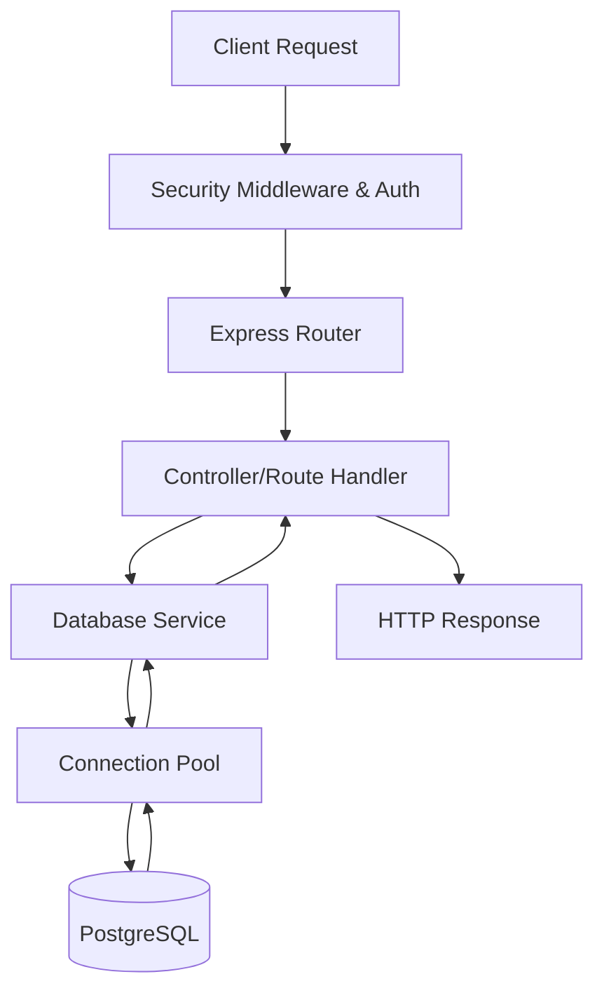

# Backend Architecture

The OpenWiki backend is a Node.js server built with [Express](https://expressjs.com/), acting as the central orchestrator for API routing, authentication, session management, and asynchronous background tasks.

## Server Initialization & Entrypoint

The application is initialized in `repo://server.ts`. It performs the following setup:
- Loads environment configuration via `dotenv`.
- Configures core Express middleware, including request compression, security headers (CSP, Referrer, Frame-Options), and JSON body parsing.
- Initializes session and authentication services.

## Request Lifecycle

The system processes incoming requests through a security-hardened middleware pipeline before dispatching them to domain-specific controllers.

## Security & Middleware Pipeline

Before mounting API routers, `repo://server.ts` applies several security measures:
- **Content Security Policy (CSP)**: Restricts resource loading to trusted origins.
- **Referrer Policy**: Set to `strict-origin-when-cross-origin`.
- **Frame-Options**: `DENY` to prevent clickjacking.
- **Permissions-Policy**: Disables unused browser APIs.

## Routing & Route Mounting

API routes are organized modularly under `repo://src/routes/` and mounted onto the Express application in `repo://server.ts`:
- **Content**: `/api/books`, `/api/reviews`
- **Media**: `/api/podcasts`, `/api/podcast-recap`
- **User/Billing**: `/api/billing`, `/api/entitlements`
- **Domain Features**: `/api/monthly-review`, `/api/ask-reading`, `/api/cross-book-connections`
- **System**: `/api/upload` (Admin/Support)

A public health check endpoint is provided at `GET /health` which returns `{ ok: true }`.

## Authentication & Session Management

The backend uses `express-session` backed by PostgreSQL via `connect-pg-simple`.
- **Store**: Uses the PostgreSQL pool targeting the `chapter` schema and `session` table.
- **Helpers**: Utilities in `repo://src/auth.ts` provide methods such as `requireAuth` and `userFrom` to manage route protection and user context injection.
- **Rate Limiting**: Defined in `repo://src/auth-rate-limit.ts` to protect sensitive authentication endpoints.

## Database & Lifecycle Integration

- **Connectivity**: Managed by `repo://src/db.ts` which utilizes connection pooling to efficiently interface with the PostgreSQL database.
- **User Lifecycle**: Events such as login and user activity are processed asynchronously using `repo://src/userLifecycleTracking.ts`.

## PDF & Illustration Extraction Services

The backend includes specialized services for document processing:
- **`repo://src/extractor.ts`**: Provides text extraction for PDF and EPUB formats, including logic for slicing documents by page or reading unit ranges.
- **`repo://src/pdfExtractorWorker.mjs`**: Handles intensive PDF extraction tasks in a background worker to avoid blocking the main server loop.
- **`repo://src/illustrationAnalysis.ts`**: Facilitates the analysis and detection of illustrations within documents.
