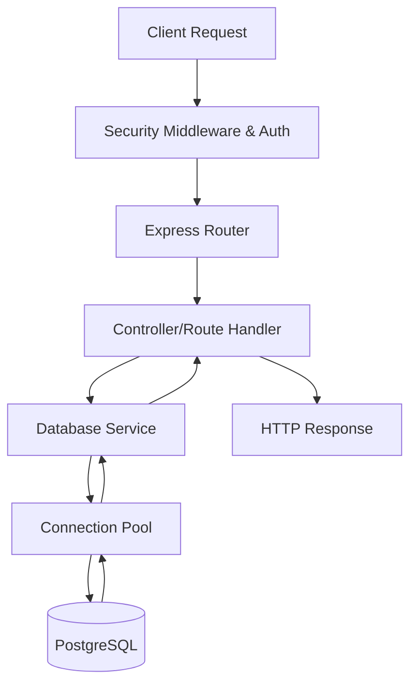

# Backend Architecture

The OpenWiki backend is a Node.js server built with [Express](https://expressjs.com/), orchestrating API routing, authentication, database persistence, session management, and integrations with external services.

## Server Initialization & Entrypoint

The main application server is initialized in `repo://server.ts`. It loads environment configuration via `dotenv`, configures Express middleware (including request compression, security headers, and JSON parsing), and attaches session and authentication mechanisms.

## Request Lifecycle

The following diagram illustrates the lifecycle of a request entering the system, progressing through middleware and routing, and interacting with the database.

## Security & Middleware Pipeline

The server establishes robust HTTP security headers prior to mounting any routers in `repo://server.ts`:
- **Content Security Policy (CSP)**: Restricts resource loading to trusted origins.
- **Referrer Policy**: Set to `strict-origin-when-cross-origin`.
- **Frame-Options**: Set to `DENY` to prevent clickjacking.
- **Permissions-Policy**: Disables unused browser APIs.

## Routing & Route Mounting

API routes are structured modularly under `repo://src/routes/` and mounted onto the Express application in `repo://server.ts`. 

- **Books & Reviews**: `/api/books`, `/api/reviews`
- **Media**: `/api/podcasts`, `/api/podcast-recap`
- **User/Billing**: `/api/billing`, `/api/entitlements`
- **Features**: `/api/monthly-review`, `/api/ask-reading`, `/api/cross-book-connections`
- **Admin/Support**: `/api/upload`

A public health check endpoint is provided at `GET /health` which returns `{ ok: true }` without requiring database or session verification.

## Authentication & Session Management

Session handling relies on `express-session` backed by PostgreSQL via `connect-pg-simple` as configured in `repo://server.ts`.

- **Store**: Uses the PostgreSQL pool targeting the `chapter` schema and `session` table.
- **Helpers**: Utilities in `repo://src/auth.ts` (`requireAuth`, `userFrom`) protect routes and inject user context.
- **Rate Limiting**: Authentication-specific limits are defined in `repo://src/auth-rate-limit.ts`.

## Database & Lifecycle Integration

- **Connectivity**: Managed by `repo://src/db.ts` utilizing connection pooling.
- **Lifecycle Tracking**: User lifecycle events (e.g., login, activity) are processed asynchronously via `repo://src/userLifecycleTracking.ts`.
