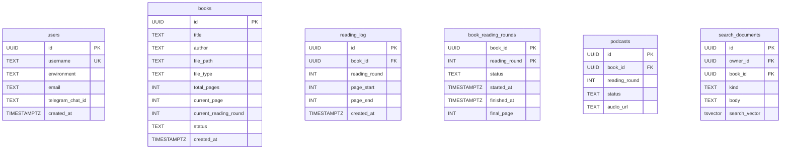

# Database Schema & Migrations

The Chapter AI Daily Book Reading Companion relies on PostgreSQL (targeting PostgreSQL 13+) for persistent data storage, session management, and transaction safety. The schema is organized under the dedicated `chapter` schema within the database (configured via connection string search paths and connection bootstrapping) [repo://src/db/schema.sql#L15-L16].

---

## Connection Management & Execution (`src/db.ts`)

Database connections are managed via `node-postgres` (`pg`) in `src/db.ts`. Connection pooling and query safety are structured around distinct execution patterns and timeouts:

- **Pool Configuration**: `getPool()` initializes a shared `Pool` configured via `DATABASE_URL` or fallback localhost parameters (`chapter` database, user `postgres`, max 10 connections) [repo://src/db.ts#L25-L40].
- **Date Parser Optimization**: PostgreSQL `DATE` columns (OID `1082`) are parsed into plain `YYYY-MM-DD` strings rather than JavaScript `Date` objects. This prevents timezone shifting issues during JSON serialization across Express [repo://src/db.ts#L4-L11].
- **Timeouts & Safety**:
  - **Request Budgets (`query`, `withTransaction`)**: Enforce stricter statement and lock timeouts (`dbRequestStatementTimeoutMs`, `dbRequestLockTimeoutMs`) designed for fast HTTP request SLAs [repo://src/db.ts#L16-L19, L102, L143].
  - **Background Budgets (`backgroundQuery`, `withBackgroundTransaction`)**: Provide larger timeouts (`dbBackgroundStatementTimeoutMs`, `dbBackgroundLockTimeoutMs`) for batch processing, AI enrichment, and backfill tasks [repo://src/db.ts#L20-L23, L107, L148].
- **Transactional Safety**: `timedTransaction` and `timedQuery` wrap operations in an explicit `BEGIN`, apply local transaction-level timeouts via `set_config('statement_timeout', ...)` and `set_config('lock_timeout', ...)` with `is_local = true`, and guarantee robust `COMMIT` or `ROLLBACK` handling [repo://src/db.ts#L56-L98, L120-L140].

---

## Core Database Schema

The complete database schema is maintained in `src/db/schema.sql` and verified on startup via `verifyCoreSchema()` [repo://src/db.ts#L154-L197].

---

## Database Schema Changes

Recent schema migrations focus on unifying search capabilities across generated and user-provided artifacts:

- `20260908_add_unified_library_search.sql`: Introduces `chapter.search_documents` for efficient, normalized full-text search across books, wikis, notes, reflections, story threads, and story memory snapshots. This table utilizes GIN indexes on `search_vector` for high-performance retrieval [repo://migrations/20260908_add_unified_library_search.sql].
