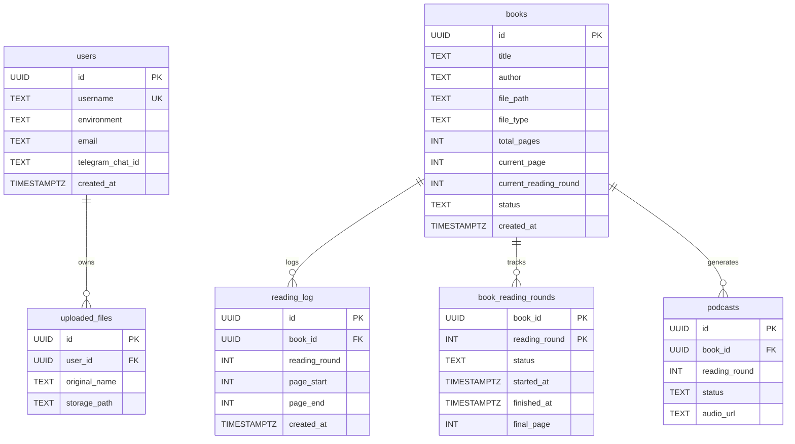

# Database Schema & Migrations

The Chapter AI Daily Book Reading Companion relies on PostgreSQL (targeting PostgreSQL 13+) for persistent data storage, session management, and transaction safety. The schema is organized under the dedicated `chapter` schema within the database (configured via connection string search paths and connection bootstrapping) [repo://src/db/schema.sql#L15-L16].

---

## Connection Management & Execution (`src/db.ts`)

Database connections are managed via `node-postgres` (`pg`) in `src/db.ts`. Connection pooling and query safety are structured around distinct execution patterns and timeouts:

- **Pool Configuration**: `getPool()` initializes a shared `Pool` configured via `DATABASE_URL` or fallback localhost parameters (`chapter` database, user `postgres`, max 10 connections) [repo://src/db.ts#L25-L40].
- **Date Parser Optimization**: PostgreSQL `DATE` columns (OID `1082`) are parsed into plain `YYYY-MM-DD` strings rather than JavaScript `Date` objects. This prevents timezone shifting issues during JSON serialization across Express [repo://src/db.ts#L4-L11].
- **Timeouts & Safety**:
  - **Request Budgets (`query`, `withTransaction`)**: Enforce stricter statement and lock timeouts (`dbRequestStatementTimeoutMs`, `dbRequestLockTimeoutMs`) designed for fast HTTP request SLAs [repo://src/db.ts#L16-L19, L102, L143].
  - **Background Budgets (`backgroundQuery`, `withBackgroundTransaction`)**: Provide larger timeouts (`dbBackgroundStatementTimeoutMs`, `dbBackgroundLockTimeoutMs`) for batch processing, AI enrichment, and backfill tasks [repo://src/db.ts#L20-L23, L107, L148].
- **Transactional Safety**: `timedTransaction` and `timedQuery` wrap operations in an explicit `BEGIN`, apply local transaction-level timeouts via `set_config('statement_timeout', ...)` and `set_config('lock_timeout', ...)` with `is_local = true`, and guarantee robust `COMMIT` or `ROLLBACK` handling [repo://src/db.ts#L56-L98, L120-L140].

---

## Core Database Schema

The complete database schema is maintained in `src/db/schema.sql` and verified on startup via `verifyCoreSchema()` [repo://src/db.ts#L154-L197]. Below is an overview of the core architectural tables and entities:

### 1. Identity & Multi-User Authentication
- **`chapter.users`**: Stores user profiles, authentication metadata (`password_hash`, `google_sub`), environment flags (`prd` or `dev`), notification preferences (`telegram_chat_id`, `podcast_voice_gender`), and activity timestamps [repo://src/db/schema.sql#L19-L33].
- **`chapter.user_login_events`**: Tracks detailed login telemetry (auth method, client device, browser, PWA status) [repo://src/db/schema.sql#L59-L66].
- **`chapter.password_reset_tokens`**: Secure hashed storage for password recovery requests with expiration and usage tracking [repo://src/db/schema.sql#L74-L85].
- **`chapter.auth_rate_limits`**: Durable sliding-window rate limiting table using SHA-256 hashed keys for sensitive routes (`login`, `signup`, `forgot_password`, `reset_password`, `oauth`) [repo://src/db/schema.sql#L86-L97].

### 2. Session Management
- **`chapter.session`**: Backs Express session middleware using `connect-pg-simple`, ensuring sessions persist reliably across server restarts with indexed expiration times [repo://src/db/schema.sql#L112-L118].

### 3. Books & Reading Lifecycle
- **`chapter.books`**: Central repository for books, tracking reading configuration (`daily_pages`, `summary_lang`, `reading_experience`, `summary_mode`), active cursor position (`current_page`, `current_reading_round`), status (`active`, `paused`, `finished`, `queued`), and user reflections [repo://src/db/schema.sql#L123-L142].
- **`chapter.reading_log`**: Records granular reading sessions with page spans (`page_start`, `page_end`), time spent, and associated reading round [repo://src/db/schema.sql#L147-L157 in migrations].
- **`chapter.book_reading_rounds`**: Preserves multi-pass reading history. Each completed or active pass through a book maintains its own lifecycle status (`active`, `paused`, `finished`), start/finish timestamps, and final page count.

### 4. AI Readers, Story Threads, & Lenses
- **`chapter.story_thread_analyses` & `chapter.story_state_snapshots`**: Maintain persistent narrative threads, character tracking, and continuity maps for analytical/story reading experiences.
- **`chapter.reading_progress_companions` & `chapter.reading_markers`**: Support AI-driven reading progress insights and bookmark/marker metadata.
- **`chapter.ask_reading_answers` & `chapter.cross_book_connections`**: Store Q&A records against reading material and cross-book semantic connections.

### 5. Podcasts & Recaps
- **`chapter.podcasts` & `chapter.podcast_recaps`**: Manage audio generation jobs, narrator configuration per reading round, playback progress, and availability states (`ready`, `generating`, `unavailable`) [repo://migrations/20260728_add_podcast.sql, repo://migrations/20260805_podcast_narrator_per_round.sql, repo://migrations/20260826_add_podcast_unavailable_status.sql].

---

## Database Migrations & Versioning

Schema evolution is handled via versioned SQL migration scripts located in the `/migrations/` directory.

- **Execution Order**: Migrations are named chronologically by date prefix (e.g., `20260723_multi_user.sql`, `20260802_add_reading_rounds.sql`, `20260829_backfill_reading_round_history.sql`) [repo://migrations/].
- **Backfill Safety**: Recent migrations include specialized data backfills. For example, `20260829_backfill_reading_round_history.sql` populates historical reading rounds from existing `reading_log` entries prior to the introduction of the dedicated lifecycle table, using idempotency guards (`ON CONFLICT (book_id, reading_round) DO NOTHING`) to allow safe, repeated application [repo://migrations/20260829_backfill_reading_round_history.sql#L1-L37].
- **Idempotency & Constraints**: Migration scripts extensively use `IF NOT EXISTS`, `DROP CONSTRAINT IF EXISTS`, and conditional column additions (`ADD COLUMN IF NOT EXISTS`) to ensure smooth upgrades across development and production environments.

---

## Indexing & Ownership Security

- **Ownership & Access Control**: Uploaded files and user-specific entities enforce foreign key constraints with cascade rules (e.g., `REFERENCES chapter.users(id) ON DELETE CASCADE`) paired with ownership verification hardening (e.g., `20260727_hardening_upload_ownership.sql`) [repo://migrations/20260727_hardening_upload_ownership.sql].
- **Performance Indexes**: High-frequency lookup paths are indexed:
  - `idx_books_status` on `chapter.books(status)` [repo://src/db/schema.sql#L144]
  - `idx_users_last_active_at` and login event indexes for user telemetry [repo://src/db/schema.sql#L66-L67]
  - Partial unique indexes on normalized emails and Google subjects (`users_email_normalized_unique`, `users_google_sub_unique`) [repo://src/db/schema.sql#L69-L72]
  - Window cleanup indexes on rate limiting tables [repo://src/db/schema.sql#L96-L97]
