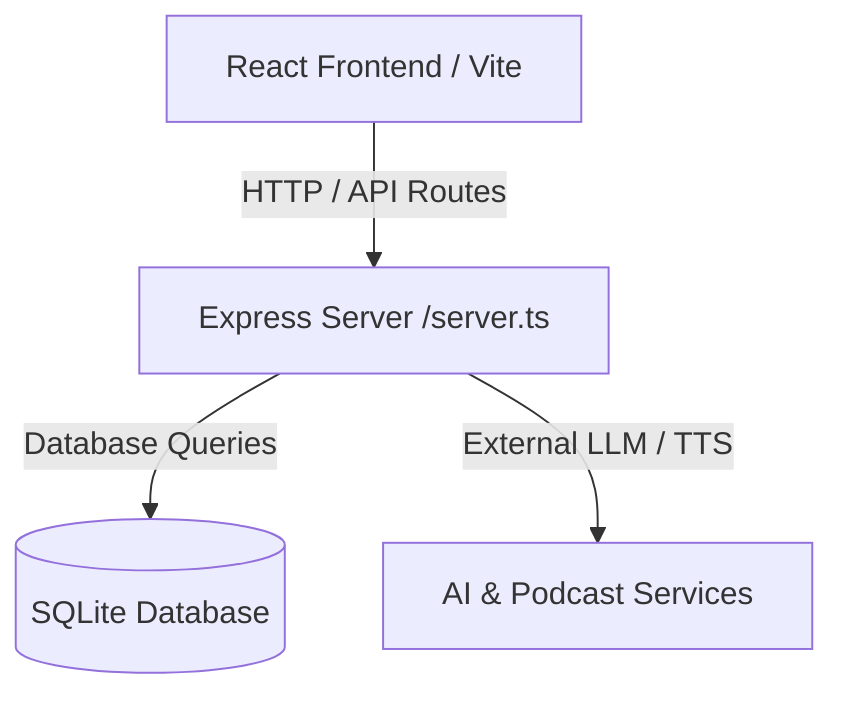

# Architecture Overview

Chapter is a full-stack reading companion application built with Node.js, Express, React, Vite, and SQLite (via better-sqlite3).

- Client: Single-page application in `/src/`, routed via custom views and hooks.
- Server: Express backend in `/server.ts`, handling authentication, reading notes, bookmarks, podcasts, and billing.
- Database: SQLite database configured via migrations in `/migrations/`.
