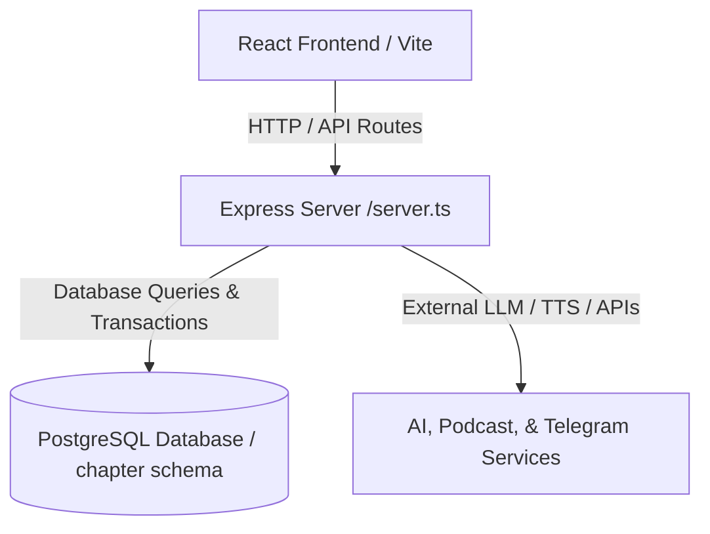

# Architecture Overview

Chapter is a full-stack reading companion application built with Node.js, Express, React, Vite, and PostgreSQL (via `pg`).

## Backend Server Structure

The backend entry point is `repo://server.ts`, which initializes an Express application, sets up security headers (helmet-like custom CSP, HSTS, frame options), configures session management with PostgreSQL via `connect-pg-simple`, and mounts various domain-specific API routers under `/api`.

- **Server Initialization & Configuration**: `repo://server.ts` loads environment variables (`.env.local`), sets up trust proxy configurations for production reverse proxies, handles compression, and applies strict security headers.
- **Middleware & Sessions**: Session state is persisted in PostgreSQL using `connect-pg-simple` within the `chapter` schema. Authentication checks and rate-limiting middleware (`repo://src/auth.ts`, `repo://src/auth-rate-limit.ts`) protect sensitive routes.

## Database Setup & Persistence

Database interactions are managed via `repo://src/db.ts`, which wraps the `pg` connection pool.

- **Connection Pool**: Configured with automatic fallback between environment-provided `DATABASE_URL` and local development defaults, forcing the `chapter` schema (`search_path=chapter`).
- **Query Execution & Timeouts**: Provides helper functions (`query`, `backgroundQuery`, `withTransaction`) that enforce strict statement and lock timeouts for request vs. background operations, and handles safe DATE type parsing for PostgreSQL.
- **Migrations & Schema**: Database schema and migrations are maintained in `repo://migrations/`, ensuring robust schema verification and bootstrap via `ensureSchema` and `verifyCoreSchema`.

## Routing & API Endpoints

Routing is modularized into discrete Express routers mounted in `repo://server.ts`:

| Router Module | Mount Path / Prefix | Responsibilities |
| :--- | :--- | :--- |
| **Books Router** | `/api/books` | Book management, reading progress, chapters, and highlights. |
| **Reviews Router** | `/api/reviews` | User book reviews and ratings. |
| **Upload Router** | `/api/upload` | File uploads for EPUBs, PDFs, and cover images. |
| **Podcasts Router** | `/api/podcasts` | Podcast generation, audio feeds, and background maintenance (`repo://src/routes/podcasts.ts`). |
| **Entitlements & Billing** | `/api/entitlements`, `/api/billing` | User subscription tiers, feature gates, and payment integrations. |
| **Monthly Reviews & Analytics** | `/api/monthly-reviews` | Aggregated reading statistics and monthly retrospectives. |
| **Ask Reading & AI** | `/api/ask-reading`, `/api/cross-book-connections` | AI-powered Q&A over books and cross-book insight generation (`repo://src/llm.ts`). |
| **Telegram Link** | Telegram webhook / link tokens | Telegram bot integration for reading reminders and quick capture (`repo://src/telegram-link.ts`). |

## Core Business Domains

1. **User Lifecycle & Authentication**: Manages registration, password hashing (`bcrypt`), OAuth2 (Google), secure session cookies, login tracking (`repo://src/userLifecycleTracking.ts`), and password reset flows (`repo://src/email.ts`).
2. **Reading & Progress Tracking**: Tracks book reading state, weekly goals (`repo://src/weekly-goal.ts`), listen rhythms (`repo://src/listenRhythm.ts`), and achievements (`repo://src/achievements.ts`).
3. **AI Integration**: Integrates with LLMs for reading assistance, automated podcast recaps, and conceptual synthesis across multiple books.
