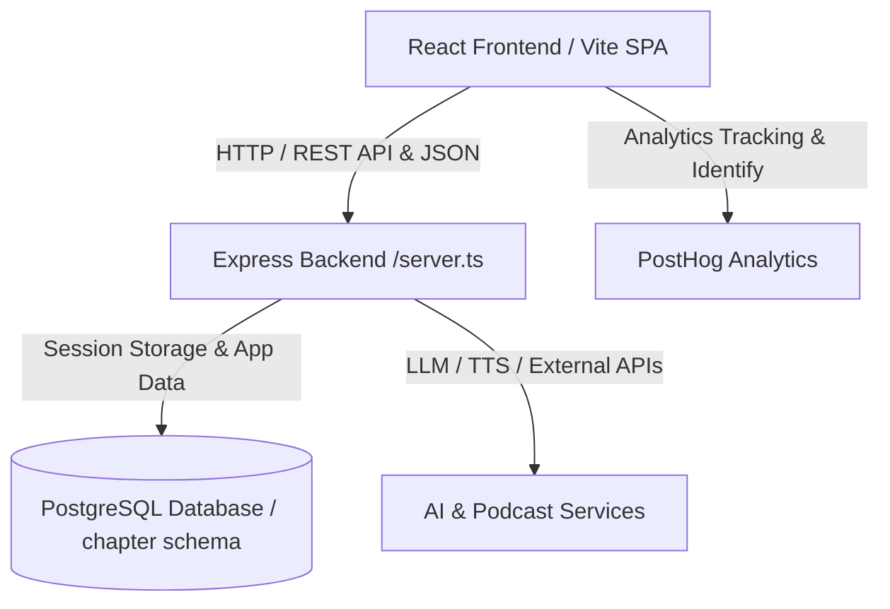

# System Architecture Overview

Chapter is a full-stack reading companion application designed for book lovers to track reading progress, manage libraries, generate AI-powered podcasts, capture insights, and review reading habits. 

The system comprises an Express backend server interfacing with a PostgreSQL database (or compatible SQL store via `pg`), and a single-page React frontend built with Vite and React Router.

---

## 1. Backend Architecture & Server Layout

The backend entry point is `repo://server.ts`, which sets up the Express application instance, configures security headers, session storage, and mounts modular feature routers under `/api`.

### Key Responsibilities & Middleware
- **Security & Headers**: Implements custom Content Security Policy (CSP), HTTP Strict Transport Security (HSTS), frame options (`DENY`), and rate limiting (`repo://src/auth-rate-limit.ts`) for sensitive auth routes.
- **Session Management**: Session state is backed by PostgreSQL via `connect-pg-simple` operating within the `chapter` database schema (`repo://server.ts`).
- **Proxy Trust**: Configured with `app.set("trust proxy", 1)` to support secure cookies behind production reverse proxies.

### Modular API Routers
Routes are modularized into dedicated feature files and mounted in `repo://server.ts`:
- **Books & Reading**: `repo://src/routes/books.ts` handles book management, reading sessions, progress tracking, and private **reading markers** (`/api/books/:id/markers`).
- **Reviews & Community**: `repo://src/routes/reviews.ts` handles user reviews.
- **Uploads**: `repo://src/routes/upload.ts` manages EPUB, PDF, and cover image uploads.
- **Podcasts**: `repo://src/routes/podcasts.ts` and `repo://src/routes/podcast-recap.ts` manage audio generation queues and feeds.
- **Entitlements & Billing**: `repo://src/routes/entitlements.ts` and `repo://src/routes/billing.ts` manage subscription tiers and payment gateways.
- **Analytics & Reviews**: `repo://src/routes/monthly-review.ts` provides monthly retrospectives.
- **AI & Cross-Book Intelligence**: `repo://src/routes/ask-reading.ts` and `repo://src/routes/cross-book-connections.ts` power LLM-based Q&A and cross-book synthesis (`repo://src/llm.ts`).
- **Telegram Integration**: `repo://src/telegram-link.ts` handles webhook linking for Telegram bot reminders and quick capture.

---

## 2. Database Layer & Persistence

Database interactions are managed through `repo://src/db.ts`, which wraps the node-postgres (`pg`) connection pool.

- **Schema Isolation**: Forces the search path to the `chapter` schema (`search_path=chapter`) across connections.
- **Query Execution & Timeouts**: Enforces timed execution wrappers (`query`, `backgroundQuery`, `withTransaction`) that apply strict statement and lock timeouts tailored for interactive requests versus background tasks (`repo://src/db.ts`).
- **Migrations & Verification**: Schema bootstrap and migrations are handled via `ensureSchema` and `verifyCoreSchema` (`repo://src/db.ts`).

---

## 3. Frontend Architecture & Client Routing

The client-side application is built as a single-page React application (`repo://src/App.tsx`), styled with Tailwind CSS, and bundled with Vite.

- **Authentication Context**: `repo://src/AuthContext.tsx` manages active session state, loading gates, and redirects unauthenticated visitors to login/signup flows.
- **App Shell & Views**: `repo://src/components/AppShell.tsx` wraps authenticated routes (`/`, `/today`, `/books/:id`, `/insights`, `/review`, `/calendar`, `/momentum`, `/achievements`, `/profile`, `/account`, `/pricing`, `/quotes`).
- **Analytics & PostHog Identity**: `repo://src/analytics.ts` initializes PostHog analytics (`posthog-js`), associating user IDs and account handles upon successful authentication (`posthog.identify`) and resetting session tracking on logout (`posthog.reset`).

---

## 4. Recent Architectural Additions

1. **Reading Markers**: Private, session-scoped bookmarks and annotations tied to active reading rounds (`repo://src/routes/books.ts`), enabling readers to drop specific page markers with notes.
2. **PostHog Identity Integration**: Frontend analytics (`repo://src/analytics.ts`) tightly coupled with user lifecycle events to track user engagement and feature adoption securely.
