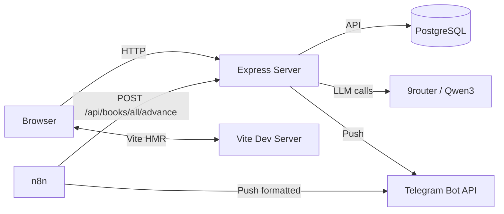
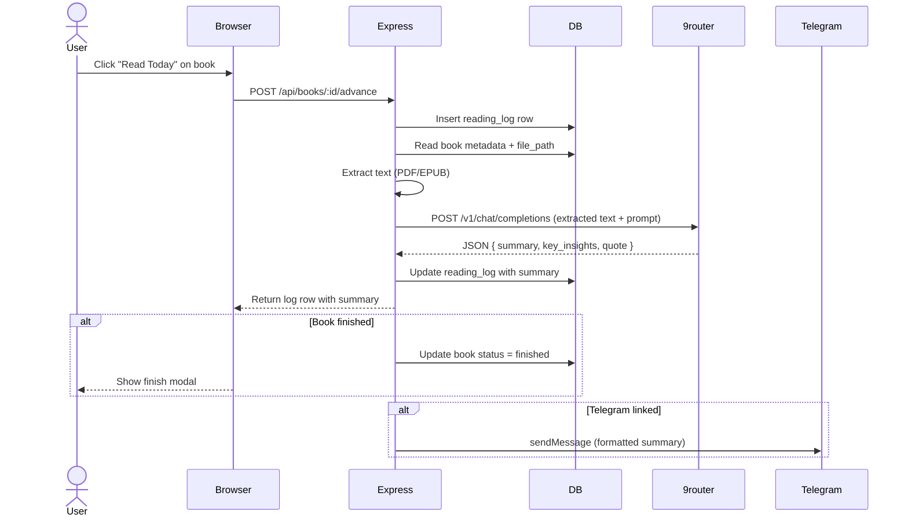

# Architecture Overview

Chapter is a self-hosted, single-page web application that helps readers manage a personal book library, track daily reading progress, and receive AI-generated summaries. It combines a **Vite + React 19** frontend with an **Express + TypeScript** backend backed by **PostgreSQL**, integrates with an Open AI-compatible LLM endpoint (9router/Qwen3), and uses **n8n** for cron-based daily summary delivery to **Telegram**.

## High-level system diagram

## Runtime components

### Express server (`server.ts`)
The backend entry point. Serves API routes and optionally the built frontend (`dist/`) in production. Key responsibilities:

- **Session management** — express-session + connect-pg-simple stores sessions in the `chapter.session` table.
- **Authentication** — password-based login (bcrypt), session-scoped middleware (`requireAuth`, `requireOwner`).
- **API routes** — books CRUD, reading log, analysis endpoints, review system, Telegram linking, achievements, weekly goals, and membership entitlements.
- **Health check** — `GET /health` returns `{ ok: true }` for liveness probes.
- **Production serving** — serves `dist/index.html` + static assets when no Vite dev server is detected.

Configuration is centralized in [`/src/config.ts`](../src/config.ts) — loaded from `.env.local`.

### Frontend SPA (`src/`)
Built with **React 19 + TypeScript**, styled with **Tailwind CSS 4**. Single-page app with client-side routing:

| Route | Page | Purpose |
|-------|------|---------|
| `/` | Library | Book grid, filter/sort/search, queue, Add Book |
| `/books/:id` | BookDetail | Reading log, heatmap, analysis views, settings |
| `/today` | Today | Daily dashboard — active book, weekly goal, due reviews |
| `/review` | Review | Spaced-repetition review cards |
| `/insights` | Insights | Reading velocity chart, stats, per-book history |
| `/calendar` | Calendar | Monthly reading calendar |
| `/momentum` | Momentum | Goal tracking and momentum score |
| `/achievements` | Achievements | Gamification milestones |
| `/account` | Account | Telegram linking and settings |
| `/pricing` | Pricing | Membership plan catalog and current entitlement preview |
| `/profile` | Profile | Avatar and display name settings |

### Database (PostgreSQL)
All data lives in the `chapter` schema of a shared `dwh` database. The `ensureSchema()` function at boot reads [`src/db/schema.sql`](../src/db/schema.sql) and applies all `CREATE TABLE IF NOT EXISTS` and `ADD COLUMN IF NOT EXISTS` statements idempotently. See the [Data Model](data-model.md) page for full schema details.

### LLM integration (`src/llm.ts`)
Chapter calls a 9router-compatible endpoint (OpenAI `/v1/chat/completions` format) for:
- **Daily summaries** — casual or deep-reading style
- **Reading Lens** — analytical argument mapping (non-fiction)
- **Story Thread** — character/plot tracking (fiction)
- **End-of-book reflection** — synthesized reflection
- **AI Reader** — batch chunk analysis and book wiki synthesis (via `src/aiReader.ts`)
- **Book Wiki** — synthesized knowledge base including concepts, themes, and chapter maps (via `src/aiReader.ts`)
- **Podcast** — AI-generated audio summaries using `src/podcast/tts.ts`

When the LLM endpoint is unreachable, a deterministic fallback message is returned to keep the pipeline verifiable end-to-end.

### Podcast integration (`src/podcast/`)
A module for generating, storing, and serving audio podcast versions of summaries. Features include TTS synthesis, podcast metadata management, and integrated UI for playback in the `Podcasts` tab.

### Membership and entitlements (`src/entitlements.ts`, `src/routes/entitlements.ts`)
The Phase 0 membership layer exposes a provider-neutral plan catalog at `GET /api/entitlements/plans` and authenticated entitlement/usage state at `GET /api/entitlements/me`. It defines `free`, `plus`, and `deep_reader` tiers, feature keys, policy-versioned quotas, and effective subscription handling; checkout is intentionally unavailable and generation boundaries only emit telemetry until enforcement is approved. Subscription state and auditable usage events are stored in `chapter.subscriptions` and `chapter.usage_events`. The `/pricing` route renders the catalog without changing the existing reading experience.

### Telegram integration
Two integration modes:
1. **Push delivery** — `src/telegram.ts` sends formatted MarkdownV2 messages via the Bot API. Used by both the server (on-demand) and the n8n workflow (cron).
2. **Account linking** — `src/telegram-link.ts` generates time-limited deep-link tokens. Users receive a `/start chapter_<token>` command that the webhook endpoint processes to bind `telegram_chat_id` to their account.

### n8n workflow
An [n8n workflow](../n8n/chapter-daily-summary.json) runs daily at 07:00 Asia/Bangkok:
1. Calls `POST /api/books/all/advance` — advances all active books by their `daily_pages` setting.
2. Reads each new log's summary.
3. Formats and sends Telegram messages to the configured chat.

## Request flow example: daily reading session

## AI Reader batch pipeline

The AI Reader (`src/aiReader.ts`, `scripts/run-ai-reader.ts`) is a separate offline pipeline that runs independently from the daily advance cron. It processes all accumulated reading logs to build a persistent per-book wiki:

1. For each unprocessed reading-log session, extracts source text and calls the LLM for **chunk analysis** (concepts, themes, characters, close reading, threads, entities, evidence).
2. After all chunks are analysed, calls the LLM to **synthesise** a single `book_wiki` blob containing overview, narrative arc, continuity maps, and session handoff context.
3. Stores the result in `chapter.book_wiki` (per book, upserted) and each chunk in `chapter.ai_reader_chunks`.

Designed for nightly PM2 cron. Uses batched LLM calls (`AI_READER_BATCH_SIZE = 5`, `AI_READER_CONCURRENCY = 2`) to stay within token limits while processing books with many sessions. The shared NineRouter dispatcher separately paces all provider request starts at 5/sec and permits up to 30 in-flight calls by default, with Read Today dispatched before background work.

## Reading Rhythm

The `src/reading-rhythm.ts` module computes streak data for the UI's 14-day heatmap and milestone system. It operates entirely in-process on reading-log dates — no additional DB tables or LLM calls. Milestones: 3 ("Finding a rhythm"), 7, 14, 30, and 100 days.

## Multi-user model
Books are owned by users (`owner_id` foreign key). The library route supports two scopes:
- `mine` — only the authenticated user's books (default)
- `all` — all users' books, grouped by reader

Access control is enforced at the route level via `requireAuth` and `requireOwner` middleware.

## Key source directories

| Directory | Contents |
|-----------|----------|
| `/src/routes/` | Express route handlers (books, reviews, upload) |
| `/src/pages/` | React page components |
| `/src/components/` | React UI components (BookCard, DaySummary, Journey*, etc.) |
| `/src/components/review/` | Spaced-repetition review UI |
| `/src/components/story/` | Story thread analysis UI |
| `/src/hooks/` | Custom React hooks (useSwipeNav) |
| `/scripts/` | Verification and utility scripts |
| `/migrations/` | SQL migration files (applied after schema.sql) |
| `/n8n/` | n8n workflow export JSON |
