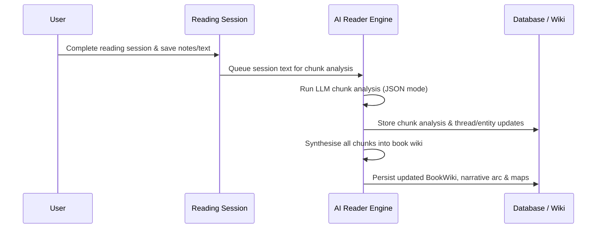

# AI Reader & Narratives

The AI Reader is an analytical intelligence layer in OpenWiki that processes saved reading sessions, builds persistent narrative continuity, synthesizes book wikis, and connects insights across multiple books. Rather than operating on raw uploaded files directly, the AI Reader consumes structured text extracted from persisted session text and reading logs.

*Figure 1: End-to-end AI Reader chunk analysis and wiki synthesis workflow.*

## Core Architecture & Data Flow

### 1. Persisted Session Text as Input
Rather than parsing raw uploaded files (such as PDFs) during runtime inference, the AI Reader consumes persisted session text and reading logs stored in the database (`reading_log`, `book_wiki`, etc.). This ensures stability, avoids redundant parsing overhead, and guarantees that the AI analyzes exactly what the reader recorded or highlighted during their reading sessions.

### 2. Reading Rounds & Lifecycle
Books undergo distinct reading rounds (`reading_round` tracking via `book_reading_rounds` and `reading_log`). As readers progress through multiple readings or revisit books, historical rounds are preserved and backfilled (e.g., via migration scripts like `20260829_backfill_reading_round_history.sql`). This historical tracking allows the AI Reader to distinguish between initial impressions and subsequent deeper engagements.

### 3. Continuity Map & Narrative Generation
The AI Reader maintains a rich narrative continuity structure that evolves session by session:
- **Chunk Analysis (`analyseChunk` / `analyseChunkBatch`)**: Processes individual reading sessions independently into structured insights, including close readings, what changes, active threads, entities, and evidence excerpts.
- **Wiki Synthesis (`synthesiseWiki`)**: Aggregates chunk analyses into a comprehensive `BookWiki` containing an overview, concepts, themes, people, chapter maps, notable quotes, open questions, and carry-forward insights.
- **Thread & Entity Maps (`thread_map`, `entity_map`)**: Tracks the lifecycle and evolution of narrative threads and entities across reading sessions.
- **Narrative Arc**: Records the progression of the book's core narrative state (`introduced`, `developing`, `resolved`, `uncertain`).

### 4. Cross-Book Connections
Beyond individual book wikis, OpenWiki synthesizes overarching connections across multiple books (`cross_book_connections.ts`). 
- **Source Gathering (`getCrossBookSource`)**: Aggregates reading logs, reading lens analyses, and book wikis for an owner across all their books.
- **Multi-Book Synthesis**: Generates overarching connections that cite evidence from at least two distinct books, producing a unified cross-book artifact (`CrossBookArtifact`).

## Invariants & Failure Handling
- **Resilient Batching**: AI Reader chunk batching (`AI_READER_BATCH_SIZE = 2`) processes multiple sessions concurrently while supporting automatic fallback to serial single-session analysis if a batch payload exceeds provider limits.
- **Strict JSON Parsing**: All LLM interactions enforce strict JSON object responses using shared JSON extraction utilities (`extractJson`) to prevent markdown preamble or trailing text corruption.
- **Companion Voice**: Automated prose generation applies strict formatting filters (`companionVoice`) to strip generic report lead-ins (e.g., "This passage discusses", "Đoạn văn giới thiệu"), ensuring a warm, direct reader-companion tone.
