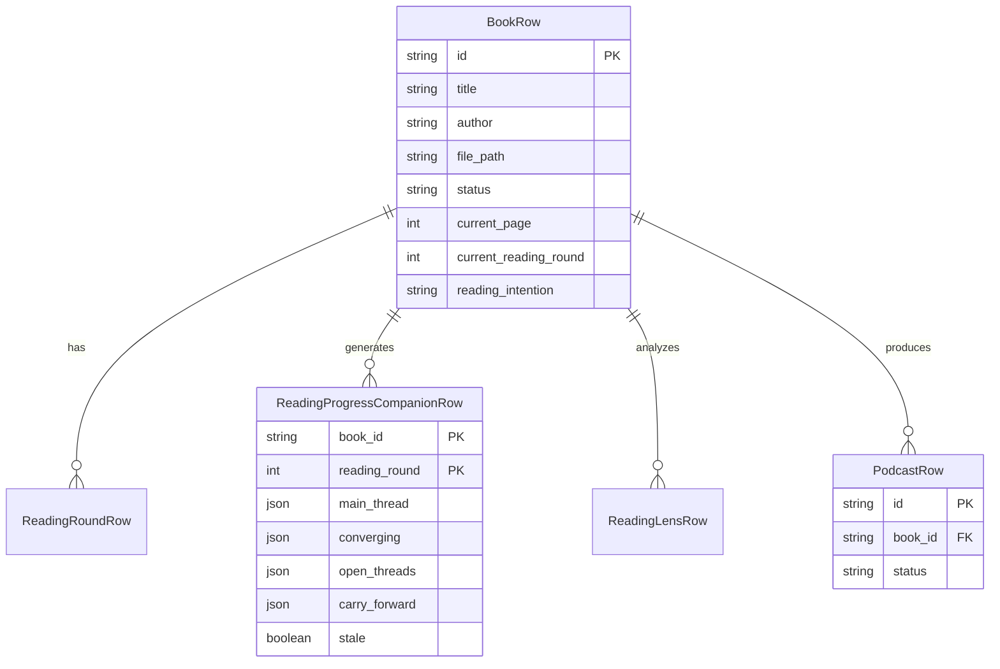

# Domain Model

The OpenWiki core domain encompasses user-owned books, reading sessions, AI-driven reading progress companions, reading intentions, and podcast generation management. This model bridges raw book files and extracted text with interactive reading progression, continuous thread tracking, and podcast summaries.

## Core Entities and Relationships

## Reading Companions and Threads

The **Reading Progress Companion** (`ReadingProgressCompanionRow`) synthesizes a book's ongoing reading logs into structured narrative threads for the current reading round. 

- **Main Thread**: The central continuous argument or narrative spine tracked across sessions.
- **Converging**: Themes or arguments where multiple reading insights intersect.
- **Open Threads**: Unresolved questions or narrative tension points to carry into subsequent pages.
- **Carry Forward**: Durable insights and principles preserved across reading rounds.

Companions maintain a `stale` flag (`ReadingProgressCompanionRow#stale`) which becomes true when new reading sessions are logged after the last companion generation, prompting readers to refresh their reading thread.

## Reading Intentions

Books support an owner-private **reading intention** (`BookRow#reading_intention`, introduced in migration `20260826_add_book_reading_intention.sql`). This field records the reader's personal motivation, learning goals, or inquiry focus when starting a book. It remains private to the owner and is distinct from shared book notes or public reviews.

## Book Upload and Content Processing

Books are ingested as PDF or EPUB files (`BookRow#file_type`). Content processing pipelines extract raw text from uploaded files, breaking text down into parseable chunks, chapters, and page ranges so that AI components (such as Reading Lenses and Companions) can generate grounded citations (`ReadingProgressItem#refs`).

## Podcast Status Management

Podcasts generated from books or daily reflections track asynchronous generation and archiving lifecycles through explicit status constraints. The status lifecycle includes:

- `queued`: Awaiting worker pick-up.
- `scripting`: Generating the dialogue or script.
- `synthesizing`: Converting scripts to audio via TTS.
- `archiving` / `archive_pending`: Storing audio artifacts.
- `ready`: Available for playback and download.
- `failed`: Encountered a terminal error during generation.
- `unavailable`: Marked as explicitly unavailable (introduced in migration `20260826_add_podcast_unavailable_status.sql`) when source material or generation prerequisites become invalid or deleted.
