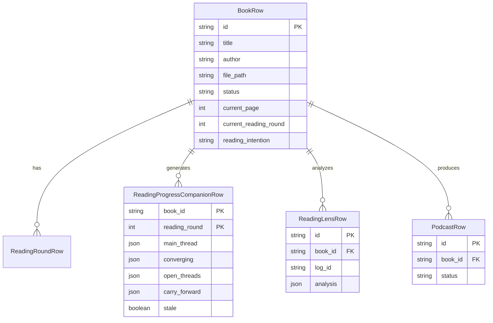

# Domain Model

The OpenWiki core domain model defines the structured entities and relationships powering the AI-assisted reading progression system. It bridges raw content ingestion with iterative reading analysis, supporting continuous tracking of narrative threads and insights.

## Core Entities and Relationships

```mermaid
erDiagram
    BookRow ||--o{ ReadingRoundRow : has
    BookRow ||--o{ ReadingProgressCompanionRow : generates
    BookRow ||--o{ ReadingLensRow : analyzes
    BookRow ||--o{ PodcastRow : produces
    BookRow {
        string id PK
        string title
        string author
        string file_path
        string status
        int current_page
        int current_reading_round
        string reading_intention
    }
    ReadingProgressCompanionRow {
        string book_id PK
        int reading_round PK
        json main_thread
        json converging
        json open_threads
        json carry_forward
        boolean stale
    }
    ReadingLensRow {
        string id PK
        string book_id FK
        string log_id
        json analysis
    }
    PodcastRow {
        string id PK
        string book_id FK
        string status
    }
```

## Book Management

Books (`BookRow`) represent the primary unit of reading, containing metadata, current progress, and owner-private reading intentions.

- **Reading Intention**: A persistent, private field (`reading_intention`) capturing the user's motivation or focus for reading a book, distinct from public notes or shared reviews.
- **Content Pipeline**: Books are ingested as PDFs or EPUBs, undergoing text extraction and chunking into parseable page ranges to provide grounded context for AI synthesis.

## Reading Companions and Threads

The **Reading Progress Companion** (`ReadingProgressCompanionRow`) aggregates reading logs across a round into structured narrative threads:

- **Main Thread**: A continuous, high-level narrative or argument spine.
- **Converging Threads**: Synthesis of intersection points among various insights.
- **Open Threads**: Active questions or unresolved tensions that persist across reading sessions.
- **Carry Forward**: Durable insights preserved to bridge disparate reading rounds.

Companions track their state consistency via a `stale` flag, indicating whether new logged data necessitates a regeneration of the current synthesis.

## Content Analysis

AI-driven tools analyze book content through specific lenses:

- **Reading Lens**: Extracts key arguments, assumptions, and concepts at specific log checkpoints, providing a focused critique or summary (`ReadingLensRow`).
- **Podcast Management**: Asynchronous audio generation tracking. Podcasts follow an explicit lifecycle (e.g., `queued`, `scripting`, `synthesizing`, `ready`, `failed`, `unavailable`) to manage TTS and archiving workflows.
