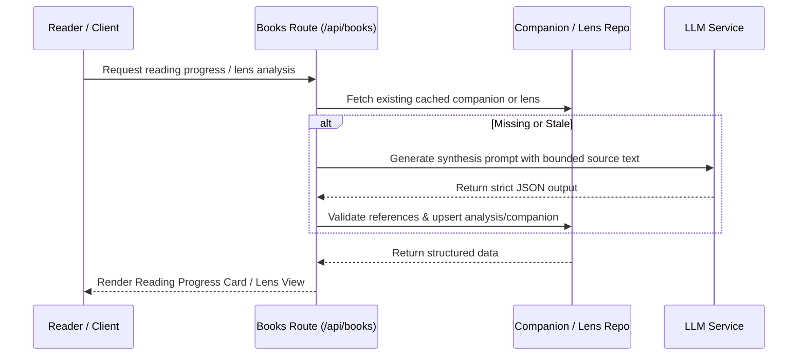

# Reading Companions & Synthesis

Reading Companions and Synthesis features provide spoiler-safe, grounded analytical frameworks and progressive companions that accompany readers throughout their book journey. These components analyze saved reading text to synthesize core arguments, track progress across sessions, and maintain structured threads without relying on outside knowledge or unverified assumptions.

## Core Architectural Components

### 1. Reading Progress Companion
The reading progress companion tracks a reader's journey through a book across multiple reading rounds and sessions. 
- **Prompt Generation & Parsing**: Located in `src/readingProgressCompanion.ts`, it builds bounded LLM prompts (`buildReadingProgressPrompt`) that instruct the model to produce strict JSON containing a main thread, converging ideas, open threads, and carry-forward points. It parses and validates output (`parseReadingProgressCompanion`) against exact source references (`ProgressSource`), ensuring every item cites 1 to 3 verifiable session log references.
- **Repository Layer**: Located in `src/readingProgressCompanionRepository.ts`, handles database persistence (`upsertReadingProgressCompanion`, `getReadingProgressCompanion`) and staleness management (`markReadingProgressCompanionStaleIfCovered`) when new reading logs are added.
- **UI Component**: Rendered via `src/components/ReadingProgressCard.tsx`, displaying the companion's thread breakdown, citation buttons for session navigation, and interactive refresh triggers.

### 2. Reading Lens Analysis
The Reading Lens provides deep analytical deconstructions of specific reading sessions or passages.
- **Analysis Engine**: Located in `src/readingLens.ts`, it parses raw LLM output (`parseReadingLensAnalysis`) into structured data containing a core argument, an argument map (claims, support, implications), assumptions and limits, key concepts, questions to carry forward, durable insights, verifiable quotes, and confidence notes.
- **Repository Layer**: Located in `src/readingLensRepository.ts`, manages versioned storage and retrieval of lens analyses (`upsertReadingLensAnalysis`, `getReadingLensAnalysisForLog`, `listReadingLensAnalyses`).

## Control Flow & Invariants

## Invariants and Safety Guarantees
- **Strict Grounding**: All reading companions and lens analyses operate exclusively on supplied source text. External facts, unverified predictions, or unseen future events are strictly prohibited.
- **Citation Verification**: Companion items must include 1–3 exact references pointing to valid session logs, page ranges, and sessions. Quotes in Reading Lens analyses are verified against the source text; unverified quotes are automatically stripped or flagged.
- **Bypassing Hallucinations**: Prompt templates explicitly forbid report-style lead-ins and enforce concise limits on lists (e.g., maximum 4 argument map rows, 5 assumptions, 6 key concepts).
