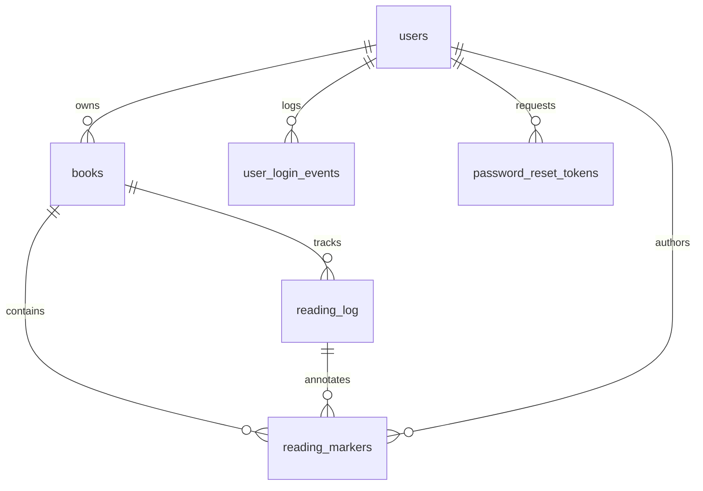

# Database Schema & Migrations

Chapter is built on a PostgreSQL database (or compatible SQL store via `pg`) using a dedicated schema isolation strategy (`chapter`). The schema design supports book tracking, reading sessions, user management, authentication tracking, AI interactions, billing orders, and private reading markers.



---

## 1. Schema Isolation & Connection Management

Database interactions are managed centrally through `repo://src/db.ts`, which wraps the node-postgres (`pg`) connection pool.

- **Schema Isolation**: All tables are created within the PostgreSQL `chapter` schema (`search_path=chapter`).
- **Connection Bootstrap (`ensureSchema`)**: On startup, the application reads `repo://src/db/schema.sql` and executes SQL bootstrap statements sequentially, handling environment permissions and logging schema status (`repo://src/db.ts`).
- **Core Schema Verification (`verifyCoreSchema`)**: Ensures all essential feature tables (e.g., `books`, `reading_log`, `reading_markers`, `auth_rate_limits`, `subscriptions`) are present before serving authenticated API requests (`repo://src/db.ts`).
- **Query Timeouts & Transactions**: Provides strict statement and lock timeouts tailored for interactive API requests versus background tasks through `withTransaction` and `withBackgroundTransaction` (`repo://src/db.ts`).

---

## 2. Core Schema Entities

The complete database structure defined in `repo://src/db/schema.sql` encompasses several domain subsystems:

### Users & Authentication
- **`chapter.users`**: Stores user profiles, roles, authentication hashes, email verification timestamps, OAuth `google_sub`, device/client metadata (`last_login_client`, `device_type`, `browser`), and environment settings (`prd` / `dev`).
- **`chapter.user_login_events`**: Immutable audit logs of authentication events (`password`, `google`, `password_reset`), client types (`web_desktop`, `web_android`, `web_ios`), device types, and browser metadata.
- **`chapter.password_reset_tokens`**: Secure tokens for password recovery linked to users with expiration timestamps and IP hash audits.
- **`chapter.auth_rate_limits`**: Durable rate limiting counters for sensitive authentication endpoints (`login`, `signup`, `forgot_password`, `reset_password`, `oauth`) keyed by SHA-256 hash combinations.

### Books & Reading Intelligence
- **Books & Reading Log**: Tables tracking user libraries, reading metadata, uploaded files (`repo://src/routes/upload.ts`), and reading sessions.
- **Reading Markers**: Private annotations and bookmarks (`repo://src/db/schema.sql`, `repo://migrations/20260828_add_reading_markers.sql`).

---

## 3. Migrations & Recent Schema Additions

Database migrations are managed via versioned SQL migration scripts located in the `/migrations/` directory and bootstrapped through `repo://src/db/schema.sql`.

### Recent Addition: Reading Markers (`migrations/20260828_add_reading_markers.sql`)
The `reading_markers` table provides persistent, session-scoped annotations tied to books, user accounts, and specific page positions:

```sql
CREATE TABLE IF NOT EXISTS chapter.reading_markers (
  id UUID PRIMARY KEY DEFAULT gen_random_uuid(),
  book_id UUID NOT NULL REFERENCES chapter.books(id) ON DELETE CASCADE,
  owner_id UUID NOT NULL REFERENCES chapter.users(id) ON DELETE CASCADE,
  reading_round INT NOT NULL CHECK (reading_round >= 1),
  log_id UUID NOT NULL REFERENCES chapter.reading_log(id) ON DELETE CASCADE,
  page_position INT NOT NULL CHECK (page_position >= 0),
  kind TEXT NOT NULL CHECK (kind IN ('idea', 'question', 'quote', 'return_to')),
  note TEXT NOT NULL DEFAULT '',
  created_at TIMESTAMPTZ NOT NULL DEFAULT now(),
  UNIQUE (book_id, owner_id, log_id, page_position, kind, note)
);

CREATE INDEX IF NOT EXISTS idx_reading_markers_book_owner_round_created
  ON chapter.reading_markers (book_id, owner_id, reading_round, created_at DESC);
```

- **Marker Kinds**: `idea`, `question`, `quote`, and `return_to`.
- **Foreign Key Cascades**: Automatically cleaned up when parent books, users, or reading logs are deleted (`ON DELETE CASCADE`).
- **Indexing**: Optimized for querying user reading markers ordered by round and creation timestamp (`idx_reading_markers_book_owner_round_created`).
