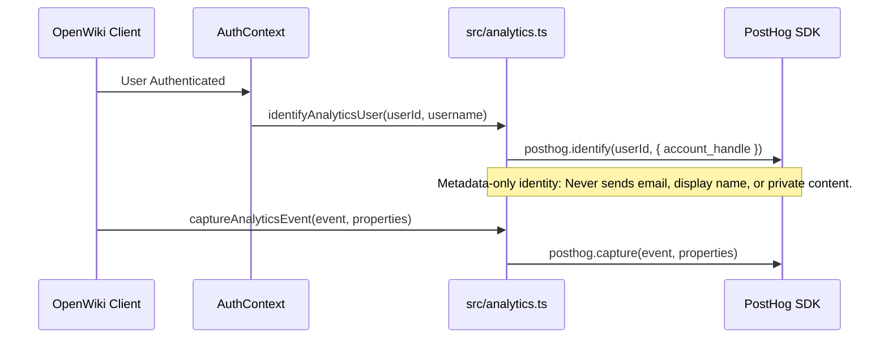
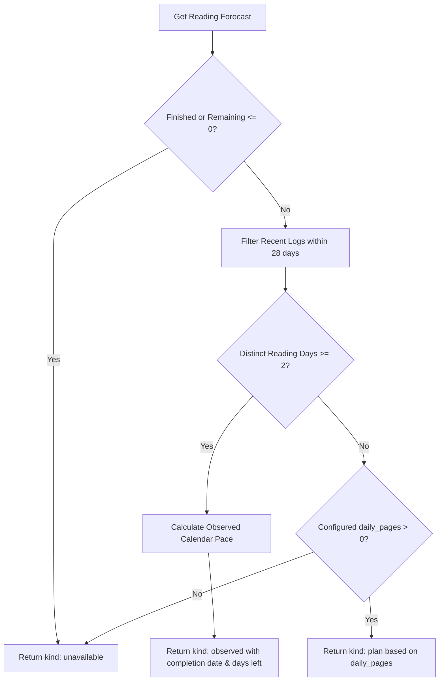

# Analytics & Reading Forecast

OpenWiki integrates product analytics via [PostHog](https://posthog.com) and provides predictive reading forecasts based on active reading sessions and logs. This page documents the architecture, privacy rules, verification scripts, and control flows for both subsystems.

## Analytics & PostHog Integration

The analytics subsystem is initialized in `src/analytics.ts` using `posthog-js`. PostHog is loaded conditionally when `VITE_POSTHOG_KEY` is provided in the environment.



### Privacy & Metadata-Only Invariants

Product analytics strictly adhere to metadata-only principles to protect reader privacy:
- **Account Identity**: `identifyAnalyticsUser` associates analytics with an opaque `userId` and an operator-friendly `account_handle` (username). It never transmits emails, display names, reading/private-content fields, titles, authors, source text, notes, transcripts, filenames, private URLs, or error messages.
- **Verification**: `scripts/verify-posthog-identity.ts` asserts that `posthog.identify` receives strictly `userId` and `{ account_handle: accountHandle }`, checks that `AuthContext.tsx` invokes `identifyAnalyticsUser(user.id, user.username)`, and confirms via static assertion that sensitive terms (`email`, `displayName`, `book_title`, `raw_text`, `notes`) never appear in identity calls.

### Tracked Events

Supported analytics events (`AnalyticsEvent`):
- Book tracking: `book_add_started`, `book_added`, `book_upload_completed`, `book_upload_failed`, `book_upload_started`, `book_wiki_opened`
- User lifecycle: `login_completed`, `sign_up_completed`, `weekly_goal_set`
- Reading sessions: `reading_session_completed`, `reading_session_failed`, `reading_session_started`, `review_completed`
- Podcast & Media: `podcast_episode_completed`, `podcast_episode_played`, `podcast_generation_requested`

---

## Reading Forecast Subsystem

The reading forecast feature (`src/readingForecast.ts`) estimates when a reader will finish an active book based on recent reading activity or falls back to their configured reading plan.



### Forecast Calculation Rules

1. **Observed Forecast (`kind: "observed"`)**:
   - Requires at least 2 distinct recent reading days (`MIN_READING_DAYS = 2`) within a rolling 28-day window (`RECENT_DAYS = 28`).
   - Calculates units read and calendar span (including non-reading days between first and last recorded reading day in the window) to avoid unrealistically fast "active days only" estimates.
   - Computes remaining units, required reading days left, and projected completion date.
2. **Plan Fallback (`kind: "plan"`)**:
   - If fewer than 2 recent reading days exist, the subsystem checks if `book.daily_pages > 0`.
   - Returns a plan-based forecast estimating remaining days using the configured daily page rate.
3. **Unavailable (`kind: "unavailable"`)**:
   - Returned when the book status is `finished`, remaining units are `0` or negative, or neither observed logs nor daily plan rates are available.

---

## Verification Scripts

Both subsystems are covered by strict verification scripts:
- **`scripts/verify-posthog-identity.ts`**: Validates PostHog initialization, privacy constraints, and `AuthContext` integration.
- **`scripts/verify-reading-forecast.ts`**: Tests forecast edge cases (observed calculations, sparse logs, single-day logs, prior round exclusions, and unavailable states).

To run verification checks:
```bash
npx tsx scripts/verify-posthog-identity.ts
npx tsx scripts/verify-reading-forecast.ts
```
