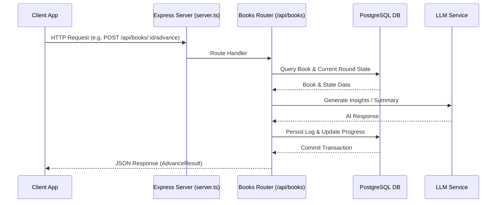

# API Routes

The Chapter reading-companion backend exposes an authenticated API surface built with Express. Routes are organized around core domains: books and reading sessions, review schedules, weekly goals, dashboard metrics, entitlements, billing, and AI-driven reading synthesis features (such as reading progress companions, story threads, reading lenses, monthly reviews, and cross-book connections).

## Architecture & Entrypoints

The main Express application is configured in `server.ts`, which mounts various routers under `/api` or specific resource paths. Book-related routes are handled by `booksRouter` defined in `src/routes/books.ts`, while the unified TypeScript API client interface is defined in `src/api.ts`.

*Request flow for advancing a reading session and generating AI synthesis.*

## Core Endpoints & Data Flows

### 1. Books & Reading Sessions (`/api/books`)
- **`GET /api/books`**: Lists books based on scope (`mine` or `all`).
- **`POST /api/books`**: Creates or registers a new book entity.
- **`GET /api/books/:id`**: Retrieves details for a specific book.
- **`PATCH /api/books/:id`**: Updates book metadata.
- **`DELETE /api/books/:id`**: Deletes a book.
- **`POST /api/books/:id/advance`**: Advances reading progress for a book. Extracts units, invokes LLM summarization and insight extraction, writes a reading log, and returns an `AdvanceResult`.
- **`GET /api/books/:id/log`**: Fetches reading logs/history for a book and optional reading round.
- **`POST /api/books/:id/reread`**: Initiates a new reading round for a book.

### 2. Reading Synthesis & Companions
- **Reading Progress (`/api/books/:id/reading-progress`)**: Computes or retrieves companion reading progress summaries.
- **Reading Lens (`/api/books/:id/reading-lens`)**: Provides analytical lens breakdowns for reading logs.
- **Story Threads (`/api/books/:id/story-thread`)**: Tracks narrative and thematic continuity across reading sessions.
- **AI Synthesis Endpoints (`/api/monthly-review`, `/api/cross-book-connections`, `/api/ask-reading`, `/api/podcast-recap`)**: Aggregate insights across multiple books and sessions to generate comprehensive reviews, answers, and audio recaps.

### 3. Reviews, Goals, & Dashboard
- **`GET /api/reviews/due`**: Retrieves due spaced-repetition review cards.
- **`POST /api/reviews/:id`**: Submits a review outcome (`remembered: boolean`).
- **`GET /api/goals/weekly`**: Fetches weekly reading goal metrics and progress.
- **`GET /api/today`**: Provides the active dashboard state, including active books, today's progress, and queue information.

### 4. Entitlements & Billing
- **`GET /api/entitlements/me`**: Returns current subscription tier, feature availability, and usage limits.
- **`GET /api/billing/catalog`**: Exposes available billing SKUs and pricing tiers.
- **`POST /api/billing/orders`**: Creates a new billing order reference.

## Invariants, Security, and Failure Semantics

- **Authentication & Ownership**: All API routes under `booksRouter` require authentication via `requireAuth`. Mutation operations enforce ownership checks (`ownerCanMutate` / `requireOwner`).
- **Transaction Safety**: Complex operations like EPUB/PDF chunk ingestion and session advancement use database transactions (`withTransaction`) and advisory locks to prevent race conditions.
- **Text Safety**: PostgreSQL TEXT fields reject NUL bytes (`\u0000`), handled by `stripNul()` during ingestion.
- **Timezone consistency**: Daily summaries and progress calculations operate in the `Asia/Bangkok` timezone (`UTC+7`).
