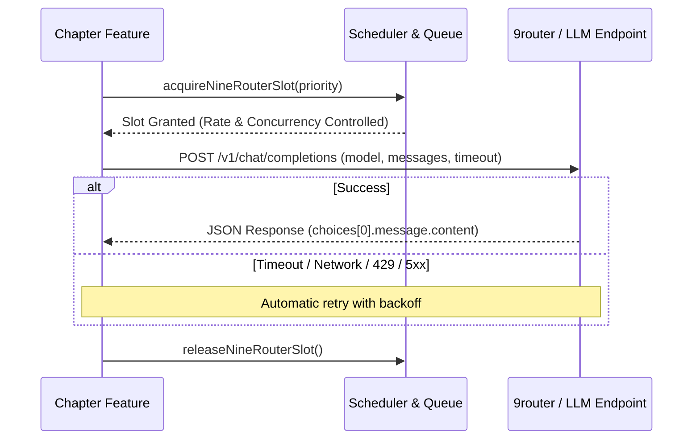
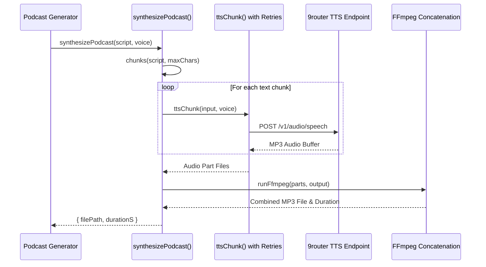

Chapter integrates with OpenAI-compatible LLM endpoints (via `NINE_ROUTER` / `src/llm.ts`) and TTS speech providers (`src/podcast/tts.ts`) to power features such as conversational reading sessions, deep reading summaries, and automated podcast generation.

## LLM Integration (`src/llm.ts`)

Chapter communicates with LLM providers through an OpenAI-compatible `/v1/chat/completions` interface.

### Prompt Construction and Control Flow
- **Entrypoints**: The core function `callLLM` in `src/llm.ts` accepts system and user prompts, temperature, strict mode, JSON mode, timeout configuration, and call options (`LlmCallOptions`).
- **Options & Traceability**: Call options include priority (`interactive` vs `background`), `traceLabel` for logging without leaking credentials or book prose, and feature-specific `model` overrides.

### Scheduler & Rate Limiting
- **Process-Local Scheduler**: `src/llm.ts` implements a shared process-local scheduler (`NINE_ROUTER_MAX_RPS`, `NINE_ROUTER_MAX_CONCURRENCY`) to pace requests and manage concurrency.
- **Prioritization**: Interactive requests (such as reader-facing summaries or chat) are prioritized over retryable background analysis, reserving at least one active slot for interactive workloads.

### Fallback Strategies & Error Handling
- **Missing URL Fallback**: If `NINE_ROUTER_URL` is unset, `callLLM` logs a warning and returns a safe fallback response (unless `strict` mode is enabled).
- **Retry Logic**: Network failures, aborts, HTTP 429 (Rate Limit), and HTTP 5xx errors trigger automatic retries (`NINE_ROUTER_MAX_ATTEMPTS`) with exponential backoff delays.

### Language Validation
- **Summary Validation**: Functions like `resolveSummaryOutputLanguage` and `validateSummaryOutputLanguage` inspect output prose for language correctness (e.g., Vietnamese diacritics and token frequency) when explicit language contracts are enforced.

---

## TTS Integration (`src/podcast/tts.ts`)

Chapter synthesizes audio for podcasts and reading tools using text-to-speech providers accessible via an OpenAI-compatible audio endpoint (`/v1/audio/speech`).

### Text Chunking & Limits
- **Sentence Splitting**: `chunks()` splits long scripts into sentences, ensuring individual chunks do not exceed `PODCAST_TTS_MAX_CHARS` (default 12,000 chars, minimum 1,000).
- **Validation**: Individual sentences exceeding character limits throw an error before dispatching to the TTS endpoint.

### Audio Assembly
- **Chunk Synthesis**: `ttsChunk()` sends chunks to `config.podcastTtsUrl` with Bearer token authorization and a 120-second timeout per chunk.
- **FFmpeg Concatenation**: `runFfmpeg()` uses an FFmpeg concat demuxer manifest file to combine individual part files into a single episode `.mp3` file, cleaning up temporary parts afterward.

### Error Handling & Retries
- **Retryable Errors**: HTTP status codes 408, 429, 500, 502, 503, and 504 as well as network timeouts are treated as retryable TTS errors (`PodcastTtsError`).
- **Exponential Backoff**: `ttsChunk` retries up to 4 times with exponential backoff and jitter.
- **Podcast Recovery**: Higher-level podcast generation workflows (`src/podcast/generate.ts`) track retry counts (`MAX_TTS_RECOVERY_ATTEMPTS = 6`, `TTS_RETRY_DELAY_MINUTES = 2`) to gracefully defer failed TTS requests for later background recovery.
