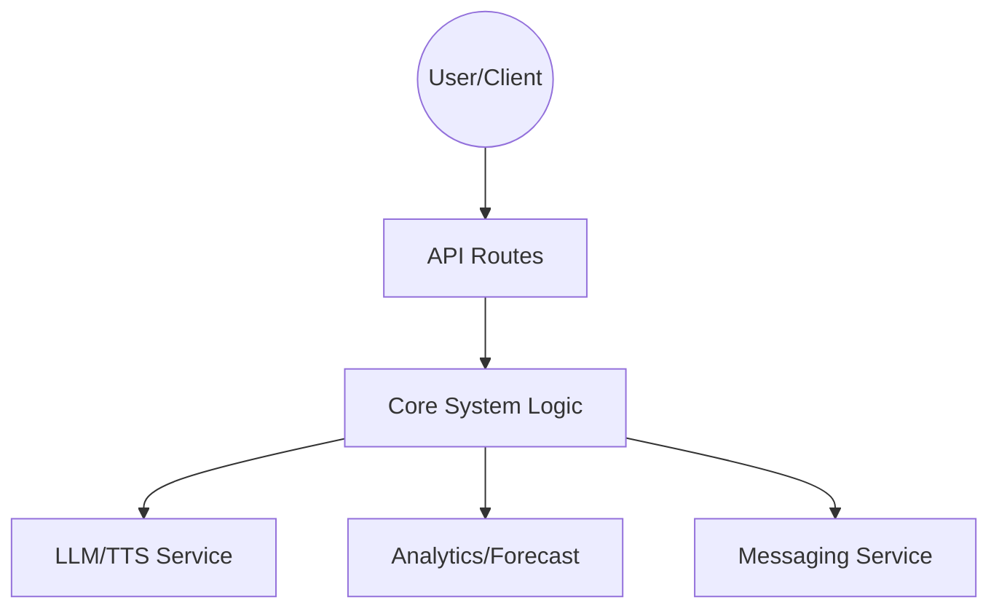

# Integration Overview

This page provides an architectural overview of how external services and internal extensions integrate with the system.

## Integration Architecture

The system supports various integration patterns to connect with third-party services and provide extensible functionality:

*   **LLM & TTS**: Integration with Large Language Models and Text-to-Speech engines for intelligent processing and output.
*   **Analytics**: Data telemetry and forecasting services to monitor system performance and usage.
*   **API Routes**: Standardized HTTP endpoints for interacting with external clients and internal components.
*   **Messaging**: Communication integrations, such as Telegram, to support real-time interactions.

## Key Integration Points

### 1. LLM & TTS
The system relies on specialized modules to bridge the gap between user input/output and AI services.
*   **Reference**: [LLM-TTS Integration](repo://openwiki/integrations/llm-tts.md)

### 2. Analytics & Forecast
Analytics engines collect usage metrics and provide predictive forecasting, essential for resource optimization and user behavior analysis.
*   **Reference**: [Analytics and Forecasting](repo://openwiki/integrations/analytics-and-forecast.md)

### 3. API Routes
Centralized management of external-facing API routes ensures consistent authentication, request validation, and response formatting.
*   **Reference**: [API Routes](repo://openwiki/integrations/api-routes.md)

### 4. Messaging
Real-time messaging integrations (e.g., Telegram) allow the system to push notifications and receive commands from external platforms.
*   **Reference**: [Telegram Integration](repo://openwiki/integrations/telegram.md)

## Control Flow
The following diagram illustrates how external requests flow through these integrated components:

