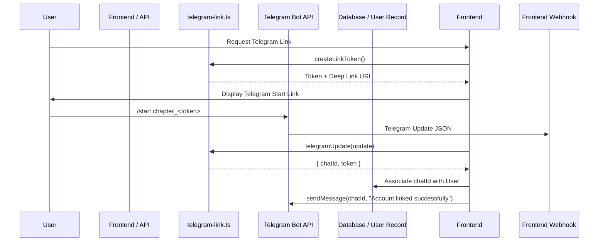

# Telegram Integration

The Telegram integration in OpenWiki provides bot-based notification delivery, user chat linking via deep-linked start tokens, and Telegram Bot API communication using native `fetch` without external Telegram SDK dependencies.

## Architecture & Responsibilities

The integration spans two core modules in `src/`:
- **`src/telegram.ts`**: Provides bot configuration loading (`getTelegramConfig`), message formatting (`formatDailyMessage` using Telegram MarkdownV2), and message sending (`sendTelegramMessage`) via the Telegram Bot API (`https://api.telegram.org`).
- **`src/telegram-link.ts`**: Handles secure account linking tokens, parsing `/start` deep-link commands (`chapter_<token>`), link expiration validation (15-minute TTL), and deep-link generation.

## Core Modules & Mechanisms

### 1. Bot Configuration & Message Sending (`src/telegram.ts`)
- **Credentials**: Server-wide bot token configured via `TELEGRAM_BOT_TOKEN` in `src/config.ts`. Individual recipient chat IDs are stored per user in the database (`users.telegram_chat_id`).
- **MarkdownV2 Escaping**: `formatDailyMessage` constructs rich reading-summary notifications (book title, author, date range, page numbers, summary, key insights, and quotes) while strictly escaping reserved Telegram MarkdownV2 characters (`_*~>#+-=|{}.!`).
- **Network Dispatch**: `sendTelegramMessage` dispatches POST requests to `/bot<token>/sendMessage` with a 10-second `AbortController` timeout, JSON payload (`parse_mode: "MarkdownV2"`, `disable_web_page_preview: true`), and response validation.

### 2. Deep-Linked Chat Association (`src/telegram-link.ts`)
- **Token Generation**: `createLinkToken()` generates 24 random bytes encoded in `base64url` (`[A-Za-z0-9_-]{24,}$`).
- **TTL & Expiry**: Links expire after 15 minutes (`LINK_TTL_MS = 15 * 60 * 1000`), enforced by `linkExpiresAt()` and `isLinkActive()`.
- **Parsing Updates**: `telegramUpdate(input)` inspects incoming webhook updates to extract the numeric/string chat ID and validate the `/start chapter_<token>` command via `parseStartToken()`.

## Configuration & Environment Variables

- `TELEGRAM_BOT_TOKEN`: The Telegram Bot API token acquired via `@BotFather`.
- `TELEGRAM_BOT_USERNAME`: The bot username used to construct deep links (`t.me/<username>?start=chapter_<token>`).
- `TELEGRAM_WEBHOOK_SECRET`: Secret token for verifying incoming webhook requests.
- `TELEGRAM_CHAT_ID`: Fallback or default chat ID for system notifications.

## Testing & Fixtures

`src/telegram-link.ts` includes `telegramLinkFixtureCheck()`, verifying token format regex, `/start` parsing correctness, positive and negative TTL link activity checks.
