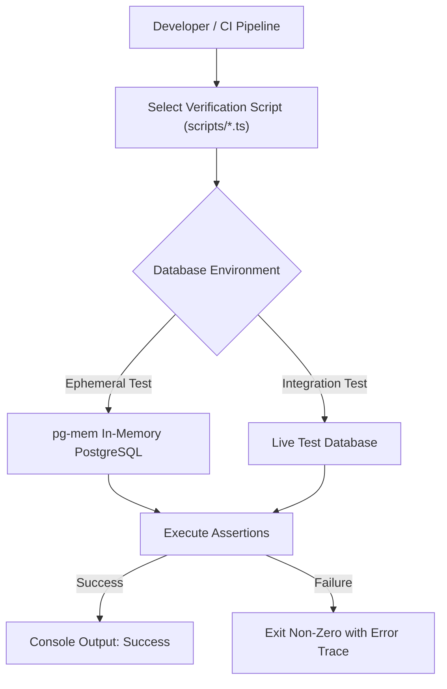

# Verification Scripts

OpenWiki utilizes a suite of TypeScript-based verification scripts to ensure component integrity, regression safety, and contract compliance across the codebase. These scripts are critical for maintaining the system's reliability during development and CI processes.

## Overview

Verification scripts are located in the `/scripts/` directory. They act as standalone integration tests, often running against in-memory PostgreSQL instances (`pg-mem`) or dedicated integration environments to validate core logic such as data parsing, file processing, and API contract adherence.

### Key Verification Scripts

*   **`verify-podcast.ts`**: Validates podcast-related features, including catalog grouping, EPUB chapter extraction, and audio progress persistence.
*   **`verify-reading-intention-reflection.ts`**: Ensures reading intention constraints and AI-based reflection output contracts are met during migration and application cycles.
*   **`verify-reading-progress-companion.ts`**: Verifies JSON parsing for reading companions, session boundary conditions, and UI/code consistency.
*   **`verify-upload-content.ts`**: Tests file ingestion pipelines, including PDF/EPUB validation, filename sanitization, and Mojibake repair for legacy unicode entries.

## Execution

Scripts are designed to be executed via Node.js using `tsx` or standard build workflows:

```bash
# Example: Running the reading progress companion verification
npx tsx scripts/verify-reading-progress-companion.ts
```

### Execution Flow



## Operational Best Practices

1.  **Contract Maintenance**: Always ensure that verification scripts are updated alongside application changes, particularly when feature contracts (e.g., `READING_PROGRESS_COMPANION_CONTRACT_OK`) are modified.
2.  **Schema Alignment**: Verification scripts rely on the core schema defined in `src/db/schema.sql`. Ensure your test environment reflects the latest database migrations before execution.
3.  **Isolation**: Use ephemeral databases (e.g., `pg-mem` as invoked by the scripts) whenever possible to prevent polluting production or persistent development data with test fixtures.
4.  **Failure Analysis**: If a script fails, the non-zero exit status provides a stack trace pinpointing the assertion failure. Always review the specific test logic in the corresponding `/scripts/` file before modifying system components.
