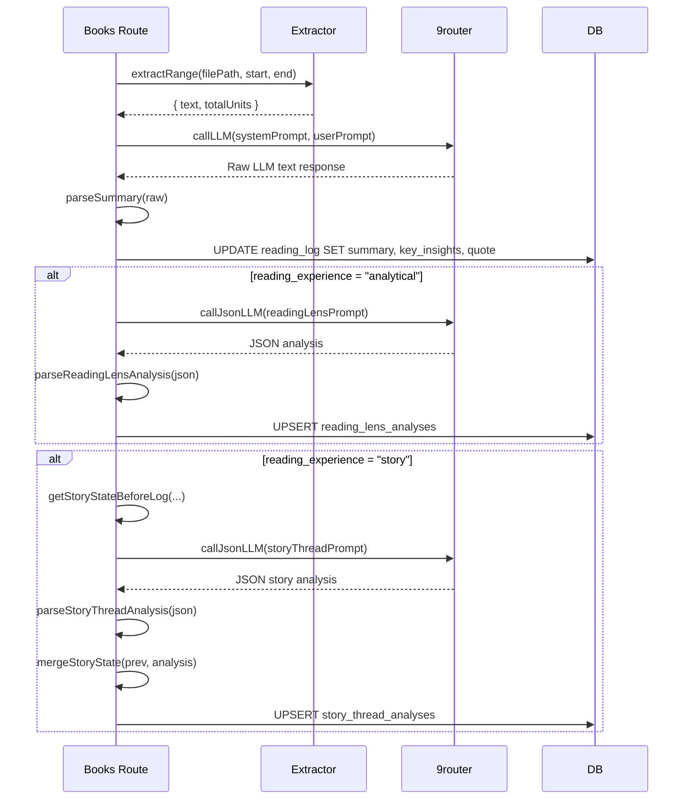

# Reading Engine

The reading engine is the core AI pipeline. Each daily reading session extracts text from a book file, sends it to an LLM for analysis, and stores the structured result.

## Pipeline overview



## Text extraction (`src/extractor.ts`)

Two distinct extraction strategies, unified behind the `extractRange(start, end, filePath, fileType)` interface:

### PDF extraction
- Uses `pdf-parse` to get per-page text.
- `extractRange()` slices by page range, returning concatenated text.
- Total units = number of pages in the PDF.

### EPUB extraction
- EPUB has reflowable text, so fixed page counts are meaningless.
- `buildEpubReadingUnits()` reads all chapters, strips HTML to paragraphs, then groups paragraphs into stable reading chunks of approximately 4,500 characters (configurable: `EPUB_TARGET_CHARS = 4500`, `EPUB_MIN_CHARS = 1800`).
- Reading chunks are persisted in `book_reading_units` once on first access.
- Total units = number of built reading chunks.

### Key behavior
- The EPUB chunk build is **lazy and idempotent** — `ensureEpubReadingUnits()` checks for existing rows before building.
- PDF page map is **ephemeral** — computed on each request (PDF page counts are stable).
- Both functions return plain text only — no formatting, no markup.

## LLM integration (`src/llm.ts`)

Connects to an OpenAI-compatible `/v1/chat/completions` endpoint (9router). Key functions:

| Function | Purpose | JSON mode | Strict |
|----------|---------|-----------|--------|
| `callLLM()` | General text generation | Optional | Configurable |
| `callJsonLLM()` | Structured JSON output | Always | Always |

### Fallback behavior
When `NINE_ROUTER_URL` is not set or unreachable:
- **Non-strict calls** — return a deterministic placeholder response ("I appreciate your reflection!...")
- **Strict/JSON calls** — throw the error (used for persisted analyses)

### Prompt structure
All prompts follow the same pattern: a **system prompt** that defines the assistant's role and output format, plus a **user prompt** containing the extracted text and metadata (title, author, page range).

## Summary modes

### Casual mode (`summary_mode = 'casual'`)
Default mode. Produces:
1. A warm, reflective 3–5 sentence narrative summary
2. Exactly 3 key insights as bullet points
3. One memorable quote (if any)

### Deep Reading mode (`summary_mode = 'deep_reading'`)
Produces a structured analysis with sections:
- **Core argument** — the central thesis or tension in the passage
- **Key points** — structured breakdown of supporting ideas
- **Critical lens** — assumptions, limits, questions
- **Connections** — how this passage relates to earlier material
- **Quote** — a significant passage from the text

Deep Reading summaries are rendered in the UI with section headings (`## Core argument`, etc.) in the DaySummary component.

## Reading Lens analysis (`src/readingLens.ts`)

Triggered when `reading_experience = 'analytical'`. Runs after each advanced session. Produces:

```typescript
interface ReadingLensAnalysis {
  coreArgument: string;
  argumentMap: { claim: string; support: string[] }[];  // max 4
  assumptionsAndLimits: string[];  // max 4
  keyConcepts: string[];            // max 6
  questionsToCarryForward: string[]; // max 3
  durableInsights: string[];
  quote: string | null;
  confidenceNotes: string;
}
```

Key behavior:
- **Quote validation** — the LLM-proposed quote is checked against the source text verbatim. If not found, it's silently dropped and a confidence note is added.
- **Bounded arrays** — all array fields are capped to prevent LLM verbosity.
- **Synthesis** — a reading lens synthesis endpoint (`POST /api/books/:id/reading-lens/synthesis`) requests an LLM to summarize all accumulated analyses into a unified reflection.

## Story Thread analysis (`src/storyThread.ts`)

Triggered when `reading_experience = 'story'`. Maintains a cumulative state of plot threads, characters, and reader memory across sessions.

```typescript
interface StoryAnalysis {
  storyRecap: string;
  threads: { name: string; status: "open" | "escalating" | "resolved" | "uncertain" }[];
  characters: { name: string; description: string }[];
  readerMemory: string[];
  confidence: string;
}
```

Key behavior:
- **Cumulative state** — `mergeStoryState()` merges new thread/character data with previous state, keyed by ID/name, keeping the latest 16 entries.
- **Rebuild on upsert** — `upsertStoryThreadAnalysis()` reads all prior analyses for the book and rebuilds the cumulative state from scratch, preventing stale data from retried analyses.
- **Input sanitization** — all strings are truncated to 900 characters and whitespace-normalized via `clean()`.

## Language support

The `summary_lang` column on books controls output language:
- `'auto'` — the LLM is instructed to respond in the same language as the passage
- `'vi'` — always Vietnamese
- `'en'` — always English

## Source files

| File | Purpose |
|------|---------|
| [`/src/extractor.ts`](../src/extractor.ts) | PDF/EPUB text extraction |
| [`/src/llm.ts`](../src/llm.ts) | 9router LLM client + prompt builder |
| [`/src/readingLens.ts`](../src/readingLens.ts) | Reading Lens prompts + parser |
| [`/src/readingLensRepository.ts`](../src/readingLensRepository.ts) | Reading Lens DB access |
| [`/src/storyThread.ts`](../src/storyThread.ts) | Story Thread prompts + parser + state merge |
| [`/src/readingUnits.ts`](../src/readingUnits.ts) | Unit label formatting helpers |
| [`/src/routes/books.ts`](../src/routes/books.ts) | Route handlers that orchestrate the pipeline |
