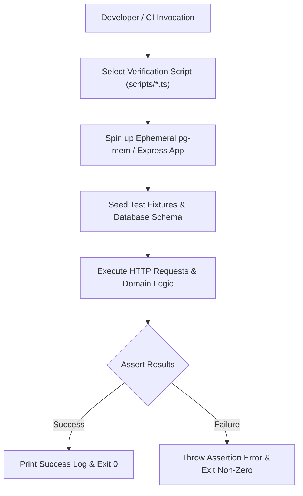

# Testing Overview

Testing and verification in **Chapter** rely on a pragmatic, script-driven integration approach rather than traditional heavy testing frameworks. Because the repository functions as a self-hosted reading companion with complex domain logic—such as EPUB processing, AI integration, and database state management—verification is centered around standalone TypeScript scripts executing against ephemeral environments.

## Testing Philosophy

1.  **Script-Driven Integration**: Each major feature is accompanied by a dedicated verification script in `scripts/` (e.g., `verify-podcast.ts`). These scripts simulate end-to-end workflows, including HTTP API calls and database state interactions.
2.  **Ephemeral Isolation**: Verification scripts frequently leverage `pg-mem` to instantiate a clean, in-memory PostgreSQL database, ensuring tests are deterministic and isolated from external environments.
3.  **Strict Assertion Contracts**: Scripts utilize `node:assert/strict` or custom helpers to validate HTTP status codes, JSON payloads, and internal database records.
4.  **Performance Audits**: When necessary, scripts profile core operations (like EPUB parsing or database migration throughput) to ensure system performance remains within acceptable bounds.

## Verification Scripts

Verification scripts are located in the `/scripts/` directory. They act as both integration tests and documentation for how features should behave.

-   **`scripts/verify-podcast.ts`**: Verifies podcast catalog grouping, EPUB chapter extraction, archive-pending states, and audio streaming with HTTP Range requests. repo://scripts/verify-podcast.ts
-   **`scripts/verify-reading-intention-reflection.ts`**: Validates database migrations for reading intentions, API routing, and AI-generated reflection prompts. repo://scripts/verify-reading-intention-reflection.ts
-   **`scripts/verify-upload-content.ts`**: Tests file upload validation, EPUB/PDF parsing, and filename sanitization.
-   **`scripts/verify-reading-progress-companion.ts`**: Checks AI reading progress companion prompts and session boundary conditions.

## Execution and Performance

### How to Run Verification Scripts
To execute individual verification suites during development or in a CI pipeline:

```bash
npx tsx scripts/verify-<script-name>.ts
```

### Performance Audits
For features that involve significant data processing or database interaction, verification scripts include performance checkpoints. Use these to verify that recent code changes do not introduce latency regressions:

```bash
# Run with performance tracking flags if available
DEBUG=performance:* npx tsx scripts/verify-podcast.ts
```

### End-to-End Workflow



## Adding New Tests

When introducing new domain logic or schema changes:

1.  **Create a Script**: Place a new verification file under `scripts/verify-<feature>.ts`.
2.  **Define Environment**: Configure an ephemeral `pg-mem` instance to reproduce the target logic.
3.  **Implement Assertions**: Include checks for both nominal paths and boundary conditions (e.g., invalid input, empty states, or authorization failures).
4.  **Verify**: Ensure the script executes cleanly and performs within expected limits before merging.
