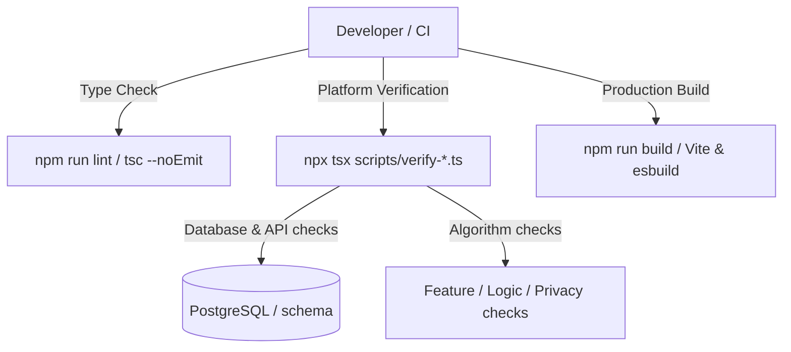

# Testing Guide

The project utilizes a robust verification-script pattern rather than traditional end-to-end test runners (such as Jest or Playwright). The testing strategy relies on isolated, executable TypeScript verification scripts located in the `scripts/` directory, supported by TypeScript type checking (`tsc --noEmit`), database schema checks, and production build pipelines.



---

## 1. Testing Strategy & Architecture

Instead of heavy end-to-end test frameworks, the application validates feature correctness, database persistence, business logic, and security invariants through **focused verification scripts**. Each script runs against either an active PostgreSQL database connection or pure logic functions to assert exact behavior.

### Key Characteristics of Verification Scripts:
- **Isolation**: Each script targets a specific subsystem (e.g., `verify-auth-signup.ts`, `verify-pdf-extractor.ts`).
- **Direct Assertions**: Scripts perform direct database insertions, API mocks/calls, and strict runtime assertions.
- **Repeatability**: Can be executed on demand during local development or pre-commit/CI checks.

---

## 2. Key Verification Test Suites

The repository defines dozens of specialized verification tasks in `package.json`. Below are representative categories:

### Subsystem & Algorithm Verification
- **Authentication**: Scripts like `repo://scripts/verify-auth-signup.ts` and `repo://scripts/verify-auth-rate-limit.ts` validate user management flows.
- **Core Logic**: Specialized scripts like `repo://scripts/verify-pdf-extractor.ts` ensure data processing components function correctly.
- **Platform & Integrity**: `repo://scripts/verify-platform-db.ts` and `repo://scripts/verify-platform-headers.ts` validate foundational infrastructure.

---

## 3. Running Verification Scripts

You can execute verification scripts individually via `npx tsx` or through npm script aliases defined in `package.json`:

```bash
# Run specific feature verifications
npx tsx scripts/verify-pdf-extractor.ts
npx tsx scripts/verify-auth-signup.ts

# Run platform database verification
npx tsx scripts/verify-platform-db.ts
```

---

## 4. Type Checking and Build Verification

Before committing changes or preparing deployments, ensure type safety and successful compilation:

### Type Checking (`lint`)
```bash
npm run lint
```
Runs TypeScript compilation with `--noEmit` against `tsconfig.json` to catch type errors across frontend and backend codebase.

### Production Build (`build`)
```bash
npm run build
```
Executes the full production build pipeline:
1. Bundles the React frontend via Vite.
2. Bundles the Express backend server via `esbuild`.
3. Copies necessary worker scripts (e.g., `src/pdfExtractorWorker.mjs`) to the distribution directory.
