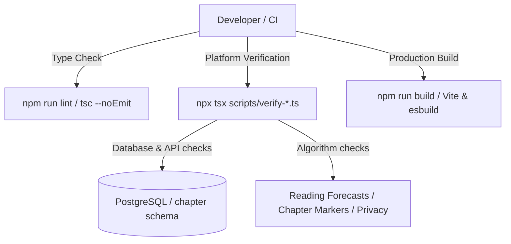

# Testing Guide

OpenWiki (Chapter) utilizes a robust verification-script pattern rather than traditional end-to-end test runners (such as Jest or Playwright). The testing strategy relies on isolated, executable TypeScript verification scripts located in the `scripts/` directory, supported by TypeScript type checking (`tsc --noEmit`), database schema checks, and production build pipelines.



---

## 1. Testing Strategy & Architecture

Instead of heavy end-to-end test frameworks, OpenWiki validates feature correctness, database persistence, business logic, and security invariants through **focused verification scripts**. Each script runs against either an active PostgreSQL database connection (`repo://src/db.ts`) or pure logic functions to assert exact behavior.

### Key Characteristics of Verification Scripts:
- **Isolation**: Each script targets a specific subsystem (e.g., `verify-chapter-markers.ts`, `verify-posthog-identity.ts`, `verify-reading-forecast.ts`).
- **Direct Assertions**: Scripts perform direct database insertions, API mocks or calls, and strict runtime assertions.
- **Repeatability**: Can be executed on demand during local development or pre-commit/CI checks.

---

## 2. Key Verification Test Suites

The repository defines dozens of specialized verification tasks in `repo://package.json` [repo://package.json#L12-L53]. Below are representative suites:

### Subsystem & Algorithm Verification
- **Chapter Markers**: `repo://scripts/verify-chapter-markers.ts` verifies table schemas, API routes (`/books/:id/markers`), UI component integrations (`ReadingMarkers`, `DaySummary`), and uniqueness constraints [repo://scripts/verify-chapter-markers.ts#L1-L16].
- **Reading Forecasts**: `repo://scripts/verify-reading-forecast.ts` tests `getReadingForecast` and `formatForecastDate` across various session histories, sparse reading logs, date gaps, reading rounds, and book completion states [repo://scripts/verify-reading-forecast.ts#L1-L54].
- **Analytics Privacy**: `repo://scripts/verify-posthog-identity.ts` ensures `posthog.identify()` receives only safe identifiers (`userId` and `account_handle`) and strictly excludes sensitive user data like email, display names, book titles, raw text, or notes [repo://scripts/verify-posthog-identity.ts#L1-L11].

### Database & Platform Integrity
- **Platform Database**: `repo://scripts/verify-platform-db.ts` validates database connection pooling, schema auto-migration, and query execution timeouts.
- **Platform Headers**: `repo://scripts/verify-platform-headers.ts` checks security headers, CSP, and HSTS configurations.
- **Entitlements & Subscriptions**: `repo://scripts/verify-entitlements.ts` and `repo://scripts/verify-membership-cache.ts` verify subscription gating, tier upgrades, and cache invalidation.

---

## 3. Running Verification Scripts

You can execute verification scripts individually via `npx tsx` or through npm script aliases defined in `repo://package.json`:

```bash
# Run specific feature verifications
npx tsx scripts/verify-chapter-markers.ts
npx tsx scripts/verify-reading-forecast.ts
npx tsx scripts/verify-posthog-identity.ts

# Run platform database verification
npx tsx scripts/verify-platform-db.ts
```

---

## 4. Type Checking and Build Verification

Before committing changes or preparing deployments, ensure type safety and successful compilation:

### Type Checking (`lint`)
```bash
npm run lint
```
Runs TypeScript compilation with `--noEmit` against `tsconfig.json` to catch type errors across frontend and backend codebase [repo://package.json#L11].

### Production Build (`build`)
```bash
npm run build
```
Executes the full production build pipeline [repo://package.json#L8]:
1. Bundles the React frontend via Vite.
2. Bundles the Express backend server via `esbuild` into `dist/server.mjs`.
3. Copies necessary worker scripts (such as `src/pdfExtractorWorker.mjs`) to the distribution directory.
