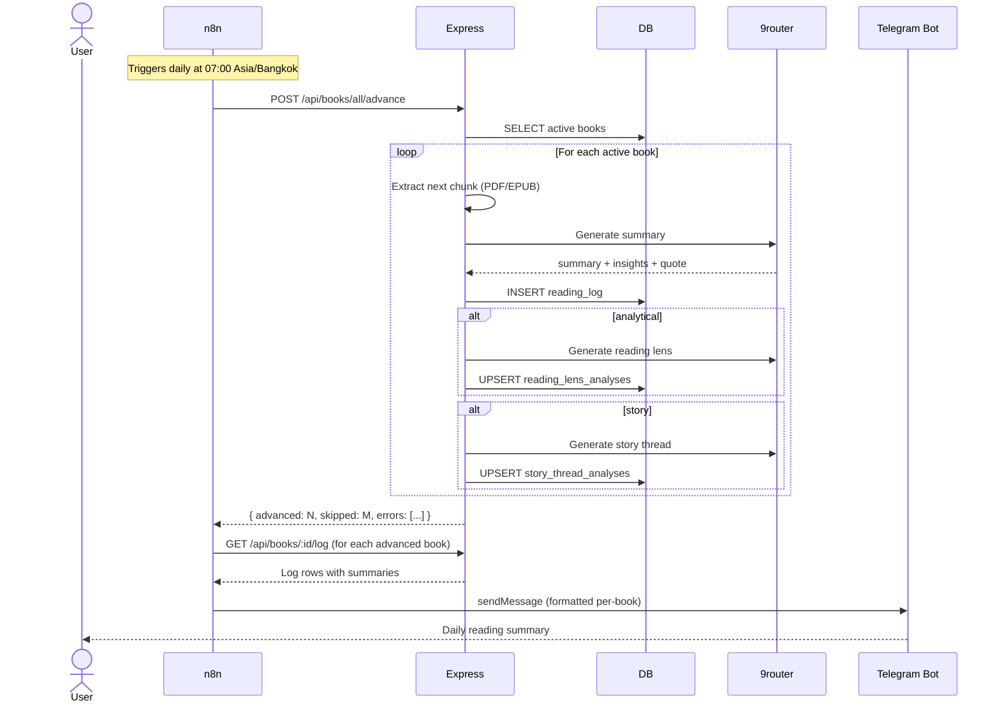

# Workflows

Chapter uses an [n8n](https://n8n.io) workflow to automate the daily reading pipeline. Each morning, the cron job advances all active books and pushes summaries to Telegram.

## Daily reading pipeline



### n8n workflow component

The workflow is exported as [`/n8n/chapter-daily-summary.json`](../n8n/chapter-daily-summary.json). It contains:

1. **Schedule trigger** — Cron expression for 07:00 daily (Asia/Bangkok timezone).
2. **HTTP Request node** — Calls `POST {{baseUrl}}/api/books/all/advance` with basic auth or session cookie.
3. **Loop / iteration** — Processes each advanced book's log.
4. **Telegram node** — Sends formatted daily summaries to the configured Telegram chat.

To import: in n8n, create a new workflow → Import from file → select `n8n/chapter-daily-summary.json`. Set the `baseUrl` parameter and Telegram credentials.

## Telegram delivery

### Push messages (`src/telegram.ts`)
The `sendTelegramMessage()` function sends MarkdownV2-formatted messages via the Telegram Bot API. Each daily summary message includes:
- Book title and author
- Date and page range
- Narrative summary (3–5 sentences)
- Key insights (bullet points)
- Memorable quote (if any)

Messages are formatted with escape handling for MarkdownV2 reserved characters.

### Telegram account linking (`src/telegram-link.ts`)
Users can link their Chapter account to Telegram to receive daily summaries:

1. User navigates to Account page → clicks "Link Telegram".
2. Server generates a 24-byte base64url token, stores it on the `users` row with a 15-minute expiry.
3. User taps the deep link (`https://t.me/<bot>?start=chapter_<token>`).
4. Telegram sends a `/start chapter_<token>` update to the bot webhook.
5. The webhook endpoint (`POST /api/telegram/webhook`) validates the secret token header, finds the user by link token, and updates `telegram_chat_id`.
6. The link token is consumed (set to NULL) to prevent replay.

The webhook is authenticated via the `x-telegram-bot-api-secret-token` header, which Telegram sends when the webhook is registered. This is separate from the session-based auth — no Chapter session is needed for Telegram to call back.

### Auto-send on manual advance
When a user manually clicks "Read Today" on a book and has a linked Telegram account, the server also sends the summary via Telegram immediately (in addition to the n8n cron delivery). This is handled in the per-book `advance` route.

## On-demand operations

### Scheduled all-book advance
The `POST /api/books/all/advance` endpoint is reserved for the n8n scheduled workflow. It advances all active books in a single request and returns how many were advanced, skipped, or errored. The Library has no bulk-read control; readers advance books individually.

### Manual "Read Today"
Per-book advance at `POST /api/books/:id/advance`. Advances one book by its `daily_pages` setting, generates the analysis, and optionally sends Telegram.

## AI Reader batch job

The `scripts/run-ai-reader.ts` script is a separate pipeline from the daily n8n cron. It processes all books that have uploaded files and LLM-analysed reading logs, then synthesises a persistent per-book wiki:

1. For each book, finds reading-log sessions not yet processed (or all sessions with `--force`).
2. Extracts text for each session using the existing extractor.
3. Runs **chunk analysis** (LLM) — extracts concepts, themes, people, close reading, threads, entities, and evidence per session.
4. Runs **synthesis** (LLM) — merges all chunk analyses into a single `book_wiki` row with narrative arc, continuity maps, and session handoff context.

Designed for nightly PM2 cron or manual invocation:
```bash
npx tsx scripts/run-ai-reader.ts                 # all books
npx tsx scripts/run-ai-reader.ts --book-id <id>  # single book
npx tsx scripts/run-ai-reader.ts --force          # reprocess all chunks
```

The AI Reader operates independently of the daily advance cron — it consumes already-generated reading logs and does not trigger new advances.

## Verification scripts

| Script | Purpose |
|--------|---------|
| `scripts/verify-telegram.ts` | Tests Telegram message sending |
| `scripts/verify-telegram-link.ts` | Tests deep link token generation and parsing |
| `scripts/verify-9router.mjs` | Tests LLM connectivity |
| `scripts/verify-phase1.mjs` | End-to-end test of the core reading pipeline |
| `scripts/verify-story-thread.ts` | Tests story thread analysis pipeline |
| `scripts/verify-onboarding.ts` | Tests onboarding progress endpoints |
| `scripts/verify-ai-reader.ts` | Tests AI Reader chunk analysis + synthesis parsing |
| `scripts/verify-reading-rhythm.ts` | Tests reading rhythm streak + milestone calculation |
| `scripts/verify-read-today.ts` | Tests Read Today button DOM constraints and enrichment flow |

Run with `tsx scripts/<name>.ts` or `tsx scripts/<name>.mjs`.
