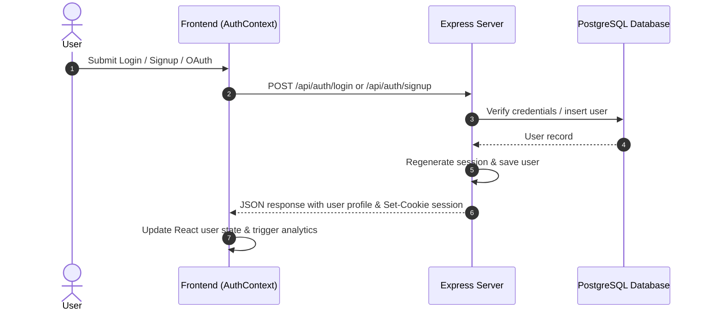

# Authentication Workflow

The authentication system in OpenWiki manages user identity, sessions, credential security, rate limiting, and OAuth 2.0 (Google) integration across both the React frontend and the Express backend.

## Overview & Architecture

The authentication flow relies on HTTP-only, secure session cookies managed by `express-session` backed by a PostgreSQL session store. 

- **Frontend (`src/AuthContext.tsx`)**: Provides an `AuthProvider` and `useAuth()` hook that exposes user state, loading status, `login`, `signup`, `completePasswordReset`, and `logout` actions. It interacts with backend endpoints via JSON requests with credentials (`credentials: "same-origin"`).
- **Backend (`server.ts`, `src/auth.ts`, `src/auth-identity.ts`, `src/auth-rate-limit.ts`)**: Implements endpoints for session checking, login, signup, Google OAuth flow, password recovery/reset, and logout. It also enforces strict rate limiting, secure password hashing (`bcrypt`), and PKCE-secured OAuth 2.0 verification.

---

## Key Components & Responsibilities

### 1. Frontend: `src/AuthContext.tsx`
- **`AuthProvider`**: On mount, performs a session check via `GET /api/auth/session` to restore session state.
- **`authRequest`**: Utility wrapper around `fetch` that automatically appends `credentials: "same-origin"`, handles JSON parsing, and throws readable error messages extracted from response payloads.
- **Actions**:
  - `login(username, password)`: Sends POST to `/api/auth/login` with PWA status detection (`isStandalonePwa()`).
  - `signup(email, displayName, password, confirmPassword)`: Sends POST to `/api/auth/signup`.
  - `completePasswordReset(token, newPassword, confirmPassword)`: Sends POST to `/api/auth/reset-password`.
  - `logout()`: Clears membership cache and posts to `/api/auth/logout`.

### 2. Backend Session Management & Security (`server.ts`, `src/auth.ts`)
- **Session Configuration**: Uses `express-session` with `connect-pg-simple` storing sessions in PostgreSQL (`chapter.session`). Cookies are configured with `httpOnly: true`, `sameSite: "lax"`, and `secure` enabled in production.
- **Middleware**:
  - `requireAuth`: Verifies `req.session.user` exists, returning `401 Unauthorized` if missing.
  - `requireOwner`: Validates resource ownership against the authenticated user ID.
  - **Rate Limiting (`src/auth-rate-limit.ts`)**: Enforces rate-limiting policies on sensitive auth routes (login, signup, password reset, OAuth).

### 3. Authentication Mechanisms

#### Password-Based Authentication
- **Signup**: Validates email normalization, display name sanitization, and password constraints (10–256 characters) via `src/auth-identity.ts`. Hashes passwords with `bcrypt` (cost factor 12) and inserts the user into the `users` table.
- **Login**: Compares submitted passwords against stored `password_hash` using `bcrypt.compare`.
- **Session Establishment (`establishSession`)**: Regenerates the Express session using `req.session.regenerate()` to prevent session fixation attacks, assigns user details, and logs lifecycle events.

#### Google OAuth 2.0 Integration
- **Initiation (`GET /api/auth/google`)**: Generates cryptographic random tokens for `state`, `nonce`, and a PKCE `verifier` / `code_challenge`. Stores them temporarily in `req.session.googleAuth` with a 10-minute TTL.
- **Callback (`GET /api/auth/google/callback`)**: Exchanges the authorization code via `OAuth2Client` using PKCE, verifies the ID token, matches or auto-provisions the user account based on Google `sub` or email, and establishes the session.

#### Password Recovery
- **Forgot Password (`POST /api/auth/forgot-password`)**: Generates an opaque recovery token, hashes it for storage in `password_reset_tokens`, and delivers a reset URL via `src/email.ts`. Always responds with a generic recovery message to prevent user enumeration.
- **Reset Password (`POST /api/auth/reset-password`)**: Consumes the valid, unexpired token within a database transaction, updates the user's password hash, revokes existing sessions, and logs the user in.

---

## Focused Tests & Invariants
- **Session Fixation Prevention**: Sessions are always regenerated upon successful authentication via `req.session.regenerate()`.
- **Environment Isolation**: Users are scoped by `environment` (e.g., `prd`, `dev`) in database queries.
- **CSRF & Cookie Security**: Strict `sameSite` and `secure` attributes protect session cookies against cross-site leakage.
