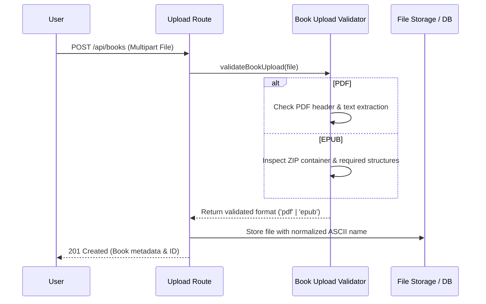
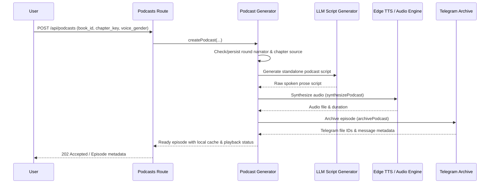

# Content Processing & Podcasts

The OpenWiki content processing and podcast generation pipeline handles importing reading material, validating formats, tracking reading progress, choosing podcast narrators, and synthesizing/archiving audio episodes.

## Content Upload & Validation

When users upload books (EPUB or PDF), the system validates file integrity, extracts text, repairs mojibake filenames, and persists standardized assets.

*Content upload and validation flow.*

- **Upload Verification**: Files are checked via `validateBookUpload` in `src/routes/upload.ts` (tested by `scripts/verify-upload-content.ts`). PDFs are verified for selectable text (rejecting scanned image-only PDFs), and EPUBs are validated as proper ZIP containers with required manifest entries.
- **Filename Sanitization**: Unicode and Latin-1 mojibake filenames are repaired via `displayUploadFilename` and stored deterministically as clean ASCII via `storedUploadFilename`.

---

## Podcast Generation, Narrator Selection & Workflow

Podcasts can be generated for indexed EPUB books. Each reading round maintains its own persistent narrator choice (female or male).

*Podcast generation and archiving workflow.*

- **Narrator Persistence**: The narrator voice (`female` or `male`) is bound per `(book_id, reading_round)`. Re-reading a book initiates a fresh session where the voice picker can be re-invoked.
- **Language Auto-Detection**: `resolvePodcastLanguage` inspects chapter text for diacritics and linguistic signals to automatically determine whether to generate Vietnamese or English audio.
- **Brief Chapter Handling**: Chapters with very few words are marked as `unavailable` (`isPodcastSourceTooBrief`), triggering automated skipping to the next eligible chapter.
- **TTS Retry & Recovery**: Upstream TTS errors are classified by `isRetryableTtsError` and retried using durable bounded budgets (`recoverRetryablePodcastTts`). If Telegram archiving fails, episodes enter an `archive_pending` state while preserving local cache playback.

---

## Reading Progress & Playback

- **Progress Tracking**: Users can update resume cursors and completion marks via `/api/podcasts/books/:bookId/playlist/progress`.
- **Audio Streaming**: Audio proxy endpoints support standard HTTP Range requests (`bytes=...`) for smooth scrubbing and seeking during playback.
