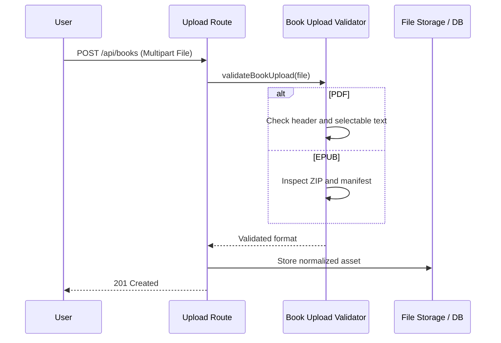

# Content Processing Workflow

The content pipeline validates uploaded reading material, extracts usable text, and stores standardized assets. PDF handling must account for both selectable text and illustrations.

## Upload validation

The upload route accepts EPUB and PDF files and invokes `validateBookUpload`. PDFs must have a valid PDF header and selectable text; scanned image-only PDFs are rejected. EPUBs must be valid ZIP containers with the required manifest structures. Upload filenames are repaired for Unicode or Latin-1 mojibake and stored deterministically as clean ASCII using `displayUploadFilename` and `storedUploadFilename`.

```mermaid
sequenceDiagram
    participant User
    participant UploadRoute as Upload Route
    participant Validator as Book Upload Validator
    participant Storage as File Storage / DB
    User->>UploadRoute: POST /api/books (Multipart File)
    UploadRoute->>Validator: validateBookUpload(file)
    alt PDF
        Validator->>Validator: Check header and selectable text
    else EPUB
        Validator->>Validator: Inspect ZIP and manifest
    end
    Validator-->>UploadRoute: Validated format
    UploadRoute->>Storage: Store normalized asset
    UploadRoute-->>User: 201 Created
```

## PDF extraction and illustration analysis

After validation, PDF processing extracts selectable text while preserving page and reading order. Illustration handling is a separate enrichment concern: embedded images are identified and analyzed when the configured processing path supports visual analysis; resulting descriptions are associated with the relevant page or content segment rather than treated as ordinary extracted text. Extraction failures or PDFs without selectable text must remain validation failures instead of silently producing an empty book.

The PDF processor should therefore preserve the relationship between an illustration and nearby captions, headings, and text. Downstream consumers can use the extracted narrative and illustration descriptions together when indexing, presenting, or generating spoken content.

## Podcast and playback hand-off

Podcast generation operates on indexed book chapters. A reading round persists its narrator choice per `(book_id, reading_round)`. Chapter language is inferred by `resolvePodcastLanguage`; very short sources are marked unavailable by `isPodcastSourceTooBrief`. TTS failures are classified by `isRetryableTtsError` and recovered with bounded durable retries through `recoverRetryablePodcastTts`. If Telegram archiving fails, the episode becomes `archive_pending` while local cached playback remains available.

Reading progress is updated through `/api/podcasts/books/:bookId/playlist/progress`, and audio proxy endpoints support HTTP Range requests for seeking.

## Focused verification

`validateBookUpload` is exercised by `scripts/verify-upload-content.ts`. Podcast generation and TTS behavior are covered by `scripts/verify-podcast.ts`; reading-progress companion behavior is checked by `scripts/verify-reading-progress-companion.ts`.
