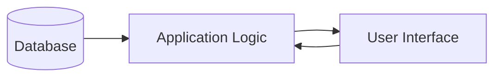

# Workflow Overview

This document provides a high-level overview of the major user-facing workflows within the system. It describes the lifecycle of data from storage to user interaction, including how sessions are managed and how content is processed.

## Data Flow

The system manages data flow by synchronizing information from persistent storage to the application layer and ultimately to the UI components for presentation.

1. **Database Layer**: Core data (content, reading progress, AI-generated insights) is stored and retrieved.
2. **Application Layer**: Business logic handles session management and transformation of raw content into structured narratives.
3. **UI Layer**: React components consume the processed data to present content and interact with the user.

## Key Workflows

### 1. Reading Sessions
Reading sessions are the primary mechanism for tracking user engagement with content. They record start/end times, current position, and active focus.
- **Initialization**: Triggered when a user opens a piece of content.
- **Persistence**: Periodic updates to the database ensure progress is saved.

### 2. AI-Reader Narratives
The AI-reader enhances content consumption by generating synthetic narratives or summaries.
- **Request**: User initiates the generation via the interface.
- **Processing**: The system fetches content, applies prompts via `repo://src/aiReader.ts`, and streams the AI output back to the UI.

### 3. Content Processing
Content processing involves the ingestion and transformation of media/text into a consumable format, managed by `repo://src/extractor.ts`.
- **Ingestion**: Raw content is stored.
- **Normalization**: Content is parsed and structured.
- **Enrichment**: Metadata and AI-generated segments are added.

### 4. Authentication
Authentication manages user identity and resource access control.
- **Session Management**: Uses `express-session` to maintain user state and identity as defined in `repo://src/auth.ts`.
- **Access Control**: Implements `requireAuth` for endpoint security and `requireOwner` to ensure resources are only modified by their owners, referencing `repo://src/auth.ts`.

