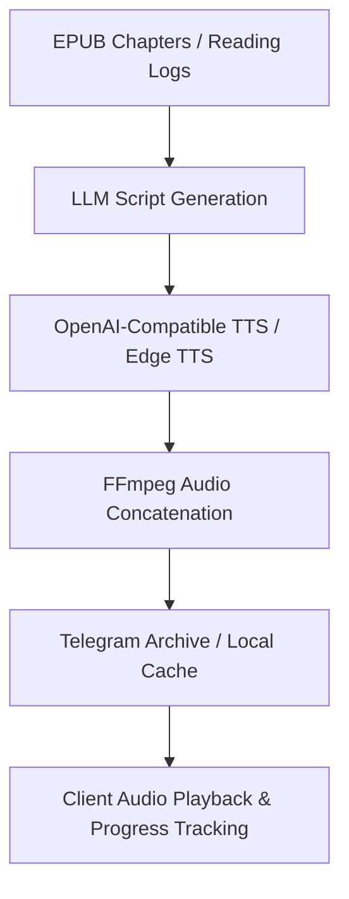

## Overview

OpenWiki incorporates chapter podcast generation and reading session audio recaps (`src/podcast/` and `src/podcastRecap.ts`). Users can generate conversational, spoken-prose podcast episodes from EPUB book chapters and concise audio recaps from saved reading activity, lens analyses, and book wiki overviews.

---

## Narrator Selection Per Reading Round

Podcast narration voices are managed per book and per reading round via the `chapter.podcast_narrators` table (`migrations/20260805_podcast_narrator_per_round.sql`).

- **Per-Round Isolation**: Each re-read round represents a fresh reading session that must select its narrator voice independently.
- **Voice Genders**: Supported voice genders are restricted to `'female'` or `'male'`.
- **Persistence**: Once a narrator voice is selected for a specific `(book_id, reading_round)`, it is persisted and applied across all episodes generated within that round. User-level profile defaults (`users.podcast_voice_gender`) are not consulted during generation.

---

## Unavailable Status Handling

When an EPUB chapter is processed for a podcast episode, the system verifies source length (`src/podcast/prompt.ts`):

- **Too Brief Check**: If chapter text falls below the minimum word count threshold (`isPodcastSourceTooBrief`), the episode status is explicitly recorded as `'unavailable'` (`error_message` prefixed with `SOURCE_TOO_BRIEF:`).
- **Auto-Skipping**: To maintain smooth listening workflows, the system automatically queues the next eligible chapter in sequence (`autoQueueNextEligiblePodcast`) up to a maximum skip chain limit (`MAX_AUTO_SKIP_CHAIN = 5`).

---

## Playback Progress Tracking and Audio Cache

- **Local Cache**: Generated MP3 files are cached locally under configured directories (`config.podcastCacheDir`) with expiration limits (`config.podcastCacheTtlHours`).
- **Telegram Archiving**: Completed episodes are archived to Telegram channels (`config.podcastTelegramArchiveChatId`), retaining file identifiers (`tg_file_id`, `tg_message_id`) for robust retrieval and fallback.
- **Progress Tracking**: Client applications track playback progress against episode duration (`duration_s`), supporting seamless resumption.

---

## Chapter Podcasts Generation (`src/podcast/`)

The chapter podcast pipeline (`src/podcast/generate.ts`) manages asynchronous lifecycle states:
1. **Queued**: Episode requested and validated against active book status.
2. **Scripting**: LLM prompt generation (`src/podcast/prompt.ts`) producing spoken prose matching book language and minimum word constraints.
3. **Synthesizing**: Text-to-speech synthesis (`src/podcast/tts.ts`) via OpenAI-compatible endpoints (`config.podcastTtsUrl`), chunking long scripts and stitching audio parts using `ffmpeg`.
4. **Archiving / Ready**: Uploading to Telegram and caching locally.
5. **Recovery Mechanisms**: Handles retryable upstream TTS failures (`isRetryableTtsError`, exponential backoff, and background recovery jobs `recoverRetryablePodcastTts` and `recoverQueuedPodcastJobs`).

---

## Podcast Recaps (`src/podcastRecap.ts`)

Reading recaps synthesize recent reading logs (`reading_log`), lens analyses (`reading_lens_analyses`), and book wiki summaries (`book_wiki`) into a unified personal audio briefing:
- **Source Aggregation**: Gathers up to 40 recent sources across active books for an owner.
- **Language Resolution**: Automatically detects language (`vi` vs `en`) based on content Vietnamese character signals.
- **Structured Prompting**: Invokes JSON-backed LLM completion to construct structured recaps (`parsePodcastRecap`) citing valid source references.
- **TTS Synthesis**: Synthesizes the final script into an audio recap cached locally for playback.
