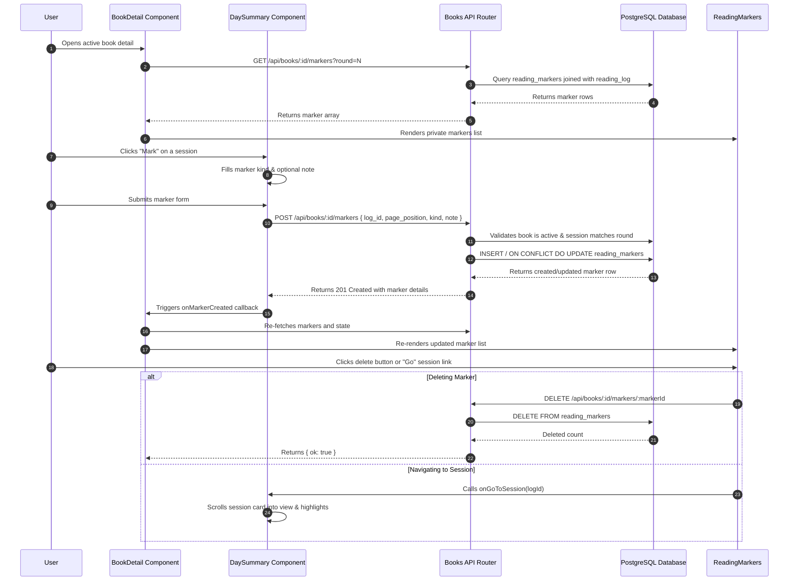

# Reading Markers Workflow

## Overview

The Reading Markers feature allows book owners to bookmark specific moments during their reading sessions. Each marker captures a particular position (page or EPUB chunk) within a saved reading session, categorized by kind (`idea`, `question`, `quote`, or `return_to`), accompanied by an optional private note (up to 500 characters). Markers are scoped to a specific reading round and owner.

## End-to-End Control Flow


*Sequence diagram showing user interaction with reading markers via BookDetail and DaySummary components, and backend persistence.*

## Database Schema

Markers are stored in the `chapter.reading_markers` table, introduced in migration repo://migrations/20260828_add_reading_markers.sql:

```sql
CREATE TABLE IF NOT EXISTS chapter.reading_markers (
  id UUID PRIMARY KEY DEFAULT gen_random_uuid(),
  book_id UUID NOT NULL REFERENCES chapter.books(id) ON DELETE CASCADE,
  owner_id UUID NOT NULL REFERENCES chapter.users(id) ON DELETE CASCADE,
  reading_round INT NOT NULL CHECK (reading_round >= 1),
  log_id UUID NOT NULL REFERENCES chapter.reading_log(id) ON DELETE CASCADE,
  page_position INT NOT NULL CHECK (page_position >= 0),
  kind TEXT NOT NULL CHECK (kind IN ('idea', 'question', 'quote', 'return_to')),
  note TEXT NOT NULL DEFAULT '',
  created_at TIMESTAMPTZ NOT NULL DEFAULT now(),
  UNIQUE (book_id, owner_id, log_id, page_position, kind, note)
);
```

An index is maintained for efficient retrieval ordered by creation time:
```sql
CREATE INDEX IF NOT EXISTS idx_reading_markers_book_owner_round_created
  ON chapter.reading_markers (book_id, owner_id, reading_round, created_at DESC);
```

## Backend API Endpoints

Defined in repo://src/routes/books.ts:

1. **GET `/api/books/:id/markers?round=N`**:
   - Requires ownership via repo://src/routes/books.ts#L871.
   - Retrieves all markers for the book, owner, and specified reading round (`reading_round`), joined with session details (`reading_log`) and formatted with a position label (`Page X` or `Chunk X`).

2. **POST `/api/books/:id/markers`**:
   - Creates or updates a marker repo://src/routes/books.ts#L890-L923.
   - Validates that the book is active repo://src/routes/books.ts#L902-L903, the session belongs to the current reading round repo://src/routes/books.ts#L908-L909, and the `page_position` falls within the session's page/chunk range repo://src/routes/books.ts#L910-L911.

3. **DELETE `/api/books/:id/markers/:markerId`**:
   - Deletes a specific marker owned by the user repo://src/routes/books.ts#L925-L938.

## Frontend Components

- **`ReadingMarkers`** (repo://src/components/ReadingMarkers.tsx):
  - Renders the list of private markers on the book detail page.
  - Supports deleting markers and jumping directly to associated session logs.
- **`DaySummary`** (repo://src/components/DaySummary.tsx):
  - Embeds the inline marker creation form within any saved reading session.
- **`BookDetail`** (repo://src/pages/BookDetail.tsx):
  - Coordinates state loading for markers, rounds, logs, and triggers re-fetches upon marker creation or deletion.
