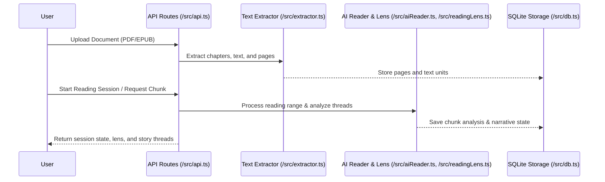

# Reading Sessions Workflow

The OpenWiki reading sessions workflow manages the end-to-end lifecycle of ingesting documents (PDF and EPUB), extracting readable text, conducting interactive reading sessions across different modes (casual reading, deep reading, and story threads), and synthesizing insights into book wikis via the AI Reader.

<em>End-to-end reading session lifecycle and text extraction flow.</em>

## Reading Modes

OpenWiki supports multiple reading modes tailored to different engagement depths and narrative tracking needs:

- **Casual Reading (`src/aiReader.ts`)**: Focuses on high-level session summaries, quick takeaways, and maintaining a lightweight narrative thread without deep structural analysis.
- **Deep Reading (`src/readingLens.ts`, `src/aiReader.ts`)**: Employs reading lenses and close-reading analysis to extract substantive concepts, character pulses, notable quotes, and entity changes across chapters.
- **Story Threads (`src/storyThread.ts`, `src/aiReader.ts`)**: Tracks narrative arcs, thematic threads, and entity movements across multiple reading sessions, establishing continuity and connections as the book progresses.

## Document Extraction & Reading Units

Document extraction is handled by `src/extractor.ts` and associated worker scripts (such as `src/pdfExtractorWorker.mjs`):
- **PDF & EPUB Ingestion**: Automatically parses structure, table of contents, chapters, and page boundaries.
- **Reading Units**: Content is segmented into discrete pages and logical reading ranges (chunks) to ensure predictable LLM processing limits and maintain context window efficiency.

## End-to-End Workflow

1. **Initialization**: A book or document is uploaded and processed into structured pages via the extraction pipeline.
2. **Execution**: Users initiate reading sessions through API endpoints. The AI Reader (`src/aiReader.ts`) and Reading Lens (`src/readingLens.ts`) analyze text chunks, evaluating active threads, entities, and changes.
3. **Conclusion**: Session insights, summaries, and updated thread maps are persisted to SQLite (`src/db.ts`) and synthesized into the overall book wiki.
