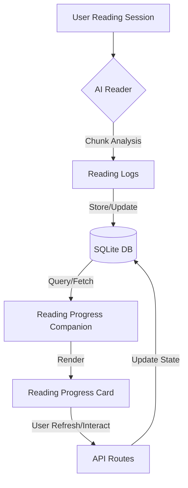

# Reading Sessions

Reading sessions in OpenWiki are the primary way users interact with their documents, enabling tracked progress through the material and continuous refinement of narrative understanding.

## Progress Tracking Workflow

The core of progress tracking relies on the `ReadingProgressCard` component, which surfaces processed insights and reading milestones back to the user.

1. **Ingestion & Processing**: As documents are read, the system tracks progress via sessions. Each session records a range of pages and maps them to narrative threads or thematic updates. The `aiReader.ts` orchestrates chunk analysis and wiki synthesis, ensuring that reading data is structured and persistent.
2. **Component Rendering**: The `src/components/ReadingProgressCard.tsx` component is responsible for displaying the progress. It receives the following data:
   - `companion`: Data from `ReadingProgressCompanionRow` that contains summarized insights, story threads, and narrative status.
   - `logs`: Historical record of reading activity.
3. **User Interaction**:
   - Users can refresh progress data via `onRefresh`.
   - Clicking on specific reference buttons within the progress card (rendered by the `Refs` sub-component in `src/components/ReadingProgressCard.tsx`) triggers `onOpenReadingSession`, allowing users to jump back to specific reading logs.

## Technical Details

The `ReadingProgressCard` and session management rely on the following mechanisms:
- **API & Persistence**: Reading progress is managed through API endpoints defined in `src/api.ts`, which interface with the persistent state stored in SQLite via `src/db.ts`.
- **Reference Resolution**: Each reading insight is anchored to specific reading logs (`LogRow`), allowing navigation between summary points and the actual text segments they refer to.
- **Glossary Tooltips**: Provides context for categories like "Story so far" and "Narrative arcs", ensuring users understand the tracking logic.
- **State Integration**: The system integrates with the broader reading companion service (`readingProgressCompanionPresentation.ts`) to calculate progress states and coverage.

